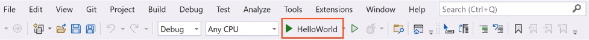

# C# 10 Fundamentals

by Gill Cleeren - [Pluralsight](https://www.pluralsight.com/)

https://app.pluralsight.com/library/courses/c-sharp-10-fundamentals/table-of-contents

> The content was organized in the _commits_

<!-- #region Course Overview -->

## Course Overview

<!-- #endregion -->

<!-- #region Getting Started with C# 10 and .NET 6 -->

## Getting Started with C# 10 and .NET 6

<!-- #region Module Introduction -->

<details>
<summary>Module Introduction</summary>
</details>

<!-- #endregion -->

<!-- #region Hello C# -->
<details>
<summary>Hello C#</summary>

<br/>

- C# is the main language for .NET development
- Object-oriented and type-safe programming language

<br/>

C# is actively mantained:
|Version|Year|
|---|---|
|1.0|2002|
|1.2|2003|
|2.0|2005|
|3.0|2007|
|4.0|2010|
|5.0|2012|
|6.0|2015|
|7.0|2017|
|8.0|2019|
|9.0|2020|
|10.0|2021|

</details>

<!-- #endregion -->

<!-- #region Setting up your environment -->

<details>
<summary>Setting up your environment</summary>

<br/>

Building .NET applications with C#:

- Visual Studio 2022 (Windows and Mac)
- .NET CLI and Visual Studio Code (all platforms)

<br/>

Introducing Visual Studio 2022:

- Flagship IDE (Integrated Development)
- Many features

<br/>

Visual Studio 2022 Editions:

- Community (free to use)
- Professional (paid, aimed at smaller teams)
- Enterprise (paid, aimed at larger teams)

</details>

<!-- #endregion -->

<!-- #region Demo: Setting up your environment using Visual Studio -->

<details>
<summary>Demo: Setting up your environment using Visual Studio</summary>

<br/>

</details>

<!-- #endregion -->

<!-- #region Building your first C# program using Visual Studio -->

<details>
<summary>Building your first C# program using Visual Studio</summary>

<br/>

Using projects:

- Containers for code files
- Compiled into executable files (assembly)
- Different templates

</details>

<!-- #endregion -->

<!-- #region Creating your first C# application -->

<details>
<summary>Creating your first C# application</summary>

<br/>

- Open Visual Studio 2022


- Create a new project


- Select C# language, **Console** project type and ConsoleApp (a project for creating a command-line application)


- Configure your new project (Project name: HelloFromCSharp, location, solution name)


- Additional information (framework .NET 6.0 LTS)


- Create and execute the project


</details>

<!-- #endregion -->

<!-- #region Demo: Writing C# Code -->

<details>
<summary>Demo: Writing C# Code</summary>

<br/>

Program.cs

```c#
// See https://aka.ms/new-console-template for more information
Console.WriteLine("Hello everybody!");

Console.WriteLine("Please enter your name: ");
string name = Console.ReadLine();
Console.WriteLine($"Hello {name}");
```

Console

```ps
Hello everybody!
Please enter your name:
Marcelo
Hello Marcelo

D:\Dev\WIP\CSharp10 Fundamentals Pluralsight\projects\HelloFromCSharp\HelloFromCSharp\bin\Debug\net6.0\HelloFromCSharp.exe (process 22516) exited with code 0.
To automatically close the console when debugging stops, enable Tools->Options->Debugging->Automatically close the console when debugging stops.
Press any key to close this window . . .
```

</details>

<!-- #endregion -->

<!-- #region Demo: Exploring the Files in a C# application -->

<details>
<summary>Demo: Exploring the Files in a C# application</summary>

<br/>

Looking at the generated files

- Project
- Solution
- Executable file

Executing our compiled application

Solution Explorer


</details>

<!-- #endregion -->

<!-- #region Debugging Our Code -->

<details>
<summary>Debugging Our Code</summary>

<br/>

Introducing Breakpoints

- Pause the running code
- Inspect the state of the running application
- Step through the different lines of code

Running with the Debugging Attached



</details>

<!-- #endregion -->

<!-- #region Demo: Debugging in Visual Studio -->

<details>
<summary>Demo: Debugging in Visual Studio</summary>

<br/>

Understanding the debugger

Tip: you can start your application with the debugger using F5

</details>

<!-- #endregion -->

<!-- #region Building Applications Using the CLI -->

<details>
<summary>Building Applications Using the CLI</summary>

<br/>

Understanding the CLI

- Command-line interface for .NET
- Cross-platform tools
- "dotnet" command with parameters

Install the .NET SDK

```ps
dotnet --list-sdks
```

Open the Windows Terminal

Creating a new project

```ps
dotnet new console -n "UnderstandingCLI"
```

| command      | description              |
| ------------ | ------------------------ |
| dotnet new   | create a new project     |
| dotnet build | compile your application |
| dotnet run   | execute your application |

</details>

<!-- #endregion -->

<!-- #region Demo: Using the Docs -->

<details>
<summary>Demo: Using the Docs</summary>

<br/>

Finding information in the docs:

https://learn.microsoft.com/pt-br/dotnet/csharp/

https://learn.microsoft.com/en-us/dotnet/api/

</details>

<!-- #endregion -->

<!-- #region Summary -->

<details>
<summary>Summary</summary>

<br/>

- C# is an object-oriented and type-safe language to write .NET applications
- C# is actively maintained
- C# can be uses to build all types of .NET applications
- Applications can be created using:

1. Visual Studio
2. CLI (combined with VS Code)

<br/>

</details>

<!-- #endregion -->

<!-- #endregion -->

<!-- #region Learning the C# Syntax -->

## Learning the C# Syntax

<!-- #region Module Introduction -->

<details>
<summary>Module Introduction</summary>

<br/>

Agenda:

- Understanding the essential C# building blocks
- Working with built-in types
- C# operators
- Using date and time
- Converting between types
- Implicit typing

</details>

<!-- #endregion -->

<!-- #region Understanding the Essential C# Building Blocks -->

<details>
<summary>Understanding the Essential C# Building Blocks</summary>

<br/>

C# Statements:

- Actions
- Flow of the program
- End with semicolon

```c#
Console.WriteLine("Hello, World!");
```

<br/>

C# Identifiers:

Identifiers start with a letter or underscore and can contain letters, digits and underscore.

```c#
string input = Console.ReadLine();
string 2_input = Console.ReadLine(); // wrong
```

<br/>

### C# Comments

- Single line comments:

Program.cs

```c#
// The next line will read a value from the console
string input = Console.ReadLine();
```

- Multiline comments:

Program.cs

```c#
/*
   In the next block of code,
   we will read a value from the console
 */
string input = Console.ReadLine();
```

<br/>

C# Keywords (about 70)

|         |          |
| ------- | -------- |
| `int`   | `ref`    |
| `in`    | `return` |
| `class` | `lock`   |
| `using` | `long`   |
| `while` | `string` |
| `new`   | `struct` |
| `null`  | `const`  |
| `if`    | `enum`   |
| `case`  | `void`   |

<br/>

C# Variables

|           |                                    |
| --------- | ---------------------------------- |
| _x_       | A variable holds a value           |
| _[1,2,3]_ | Integer, string, date ...          |
| {}        | Created in a declaration statement |

<br/>

Creating an Integer Variable

```c#
int age;
```

| Type | Identifier |
| ---- | ---------- |
| int  | age        |

<br/>

C# is case sensitive, diferente variables:

```c#
int age;
int Age;
```

<br/>

Camel Case:

Variable with many words.
The first word will always be lowercase and all subsequent words start with an uppercase.

```c#
int ageOfEmployee;
```

<br/>

Assignment a value to a variable:

```c#
int age;
age = 25;
```

| Assignment operator | Value |
| :-----------------: | :---: |
|         `=`         |  25   |

<br/>

Using the Variable:

```c#
Console.WriteLine(age);
```

</details>

<!-- #endregion -->

<!-- #endregion -->
