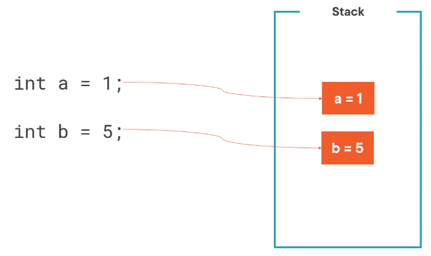
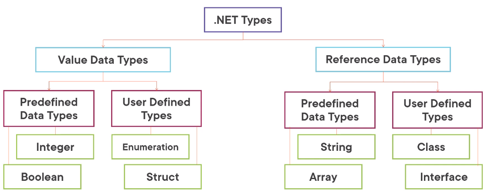

# C# 10 Fundamentals

by Gill Cleeren - [Pluralsight](https://www.pluralsight.com/)

https://app.pluralsight.com/library/courses/c-sharp-10-fundamentals/table-of-contents

> The content was organized in the _commits_

<!-- #region Course Overview -->

## Course Overview

<!-- #endregion -->

<!-- #region Getting Started with C# 10 and .NET 6 -->

## Getting Started with C# 10 and .NET 6

<!-- #region Module Introduction -->

<details>
<summary>Module Introduction</summary>
</details>

<!-- #endregion -->

<!-- #region Hello C# -->
<details>
<summary>Hello C#</summary>

<br/>

- C# is the main language for .NET development
- Object-oriented and type-safe programming language

<br/>

C# is actively mantained:
|Version|Year|
|---|---|
|1.0|2002|
|1.2|2003|
|2.0|2005|
|3.0|2007|
|4.0|2010|
|5.0|2012|
|6.0|2015|
|7.0|2017|
|8.0|2019|
|9.0|2020|
|10.0|2021|

</details>

<!-- #endregion -->

<!-- #region Setting up your environment -->

<details>
<summary>Setting up your environment</summary>

<br/>

Building .NET applications with C#:

- Visual Studio 2022 (Windows and Mac)
- .NET CLI and Visual Studio Code (all platforms)

<br/>

Introducing Visual Studio 2022:

- Flagship IDE (Integrated Development)
- Many features

<br/>

Visual Studio 2022 Editions:

- Community (free to use)
- Professional (paid, aimed at smaller teams)
- Enterprise (paid, aimed at larger teams)

</details>

<!-- #endregion -->

<!-- #region Demo: Setting up your environment using Visual Studio -->

<details>
<summary>Demo: Setting up your environment using Visual Studio</summary>

<br/>

</details>

<!-- #endregion -->

<!-- #region Building your first C# program using Visual Studio -->

<details>
<summary>Building your first C# program using Visual Studio</summary>

<br/>

Using projects:

- Containers for code files
- Compiled into executable files (assembly)
- Different templates

</details>

<!-- #endregion -->

<!-- #region Creating your first C# application -->

<details>
<summary>Creating your first C# application</summary>

<br/>

- Open Visual Studio 2022


- Create a new project


- Select C# language, **Console** project type and ConsoleApp (a project for creating a command-line application)


- Configure your new project (Project name: HelloFromCSharp, location, solution name)


- Additional information (framework .NET 6.0 LTS)


- Create and execute the project


</details>

<!-- #endregion -->

<!-- #region Demo: Writing C# Code -->

<details>
<summary>Demo: Writing C# Code</summary>

<br/>

Program.cs

```c#
// See https://aka.ms/new-console-template for more information
Console.WriteLine("Hello everybody!");

Console.WriteLine("Please enter your name: ");
string name = Console.ReadLine();
Console.WriteLine($"Hello {name}");
```

Console

```ps
Hello everybody!
Please enter your name:
Marcelo
Hello Marcelo

D:\Dev\WIP\CSharp10 Fundamentals Pluralsight\projects\HelloFromCSharp\HelloFromCSharp\bin\Debug\net6.0\HelloFromCSharp.exe (process 22516) exited with code 0.
To automatically close the console when debugging stops, enable Tools->Options->Debugging->Automatically close the console when debugging stops.
Press any key to close this window . . .
```

</details>

<!-- #endregion -->

<!-- #region Demo: Exploring the Files in a C# application -->

<details>
<summary>Demo: Exploring the Files in a C# application</summary>

<br/>

Looking at the generated files

- Project
- Solution
- Executable file

Executing our compiled application

Solution Explorer


</details>

<!-- #endregion -->

<!-- #region Debugging Our Code -->

<details>
<summary>Debugging Our Code</summary>

<br/>

Introducing Breakpoints

- Pause the running code
- Inspect the state of the running application
- Step through the different lines of code

Running with the Debugging Attached


</details>

<!-- #endregion -->

<!-- #region Demo: Debugging in Visual Studio -->

<details>
<summary>Demo: Debugging in Visual Studio</summary>

<br/>

Understanding the debugger

Tip: you can start your application with the debugger using F5

</details>

<!-- #endregion -->

<!-- #region Building Applications Using the CLI -->

<details>
<summary>Building Applications Using the CLI</summary>

<br/>

Understanding the CLI

- Command-line interface for .NET
- Cross-platform tools
- "dotnet" command with parameters

Install the .NET SDK

```ps
dotnet --list-sdks
```

Open the Windows Terminal

Creating a new project

```ps
dotnet new console -n "UnderstandingCLI"
```

| command      | description              |
| ------------ | ------------------------ |
| dotnet new   | create a new project     |
| dotnet build | compile your application |
| dotnet run   | execute your application |

</details>

<!-- #endregion -->

<!-- #region Demo: Using the Docs -->

<details>
<summary>Demo: Using the Docs</summary>

<br/>

Finding information in the docs:

https://learn.microsoft.com/pt-br/dotnet/csharp/

https://learn.microsoft.com/en-us/dotnet/api/

</details>

<!-- #endregion -->

<!-- #region Summary -->

<details>
<summary>Summary</summary>

<br/>

- C# is an object-oriented and type-safe language to write .NET applications
- C# is actively maintained
- C# can be uses to build all types of .NET applications
- Applications can be created using:

1. Visual Studio
2. CLI (combined with VS Code)

<br/>

</details>

<!-- #endregion -->

<!-- #endregion -->

<!-- #region Learning the C# Syntax -->

## Learning the C# Syntax

<!-- #region Module Introduction -->

<details>
<summary>Module Introduction</summary>

<br/>

Agenda:

- Understanding the essential C# building blocks
- Working with built-in types
- C# operators
- Using date and time
- Converting between types
- Implicit typing

</details>

<!-- #endregion -->

<!-- #region Understanding the Essential C# Building Blocks -->

<details>
<summary>Understanding the Essential C# Building Blocks</summary>

<br/>

C# Statements:

- Actions
- Flow of the program
- End with semicolon

```c#
Console.WriteLine("Hello, World!");
```

<br/>

C# Identifiers:

Identifiers start with a letter or underscore and can contain letters, digits and underscore.

```c#
string input = Console.ReadLine();
string 2_input = Console.ReadLine(); // wrong
```

<br/>

### C# Comments

- Single line comments:

Program.cs

```c#
// The next line will read a value from the console
string input = Console.ReadLine();
```

- Multiline comments:

Program.cs

```c#
/*
   In the next block of code,
   we will read a value from the console
 */
string input = Console.ReadLine();
```

<br/>

C# Keywords (about 70)

|         |          |
| ------- | -------- |
| `int`   | `ref`    |
| `in`    | `return` |
| `class` | `lock`   |
| `using` | `long`   |
| `while` | `string` |
| `new`   | `struct` |
| `null`  | `const`  |
| `if`    | `enum`   |
| `case`  | `void`   |

<br/>

C# Variables

|           |                                    |
| --------- | ---------------------------------- |
| _x_       | A variable holds a value           |
| _[1,2,3]_ | Integer, string, date ...          |
| {}        | Created in a declaration statement |

<br/>

Creating an Integer Variable

```c#
int age;
```

| Type | Identifier |
| ---- | ---------- |
| int  | age        |

<br/>

C# is case sensitive, diferente variables:

```c#
int age;
int Age;
```

<br/>

Camel Case:

Variable with many words.
The first word will always be lowercase and all subsequent words start with an uppercase.

```c#
int ageOfEmployee;
```

<br/>

Assignment a value to a variable:

```c#
int age;
age = 25;
```

| Assignment operator | Value |
| :-----------------: | :---: |
|         `=`         |  25   |

<br/>

Using the Variable:

```c#
Console.WriteLine(age);
```

</details>

<!-- #endregion -->

<!-- #region Demo: Using the Essential C# Building Blocks -->

<details>
<summary>Demo: Using the Essential C# Building Blocks</summary>

<br/>

Creating a new project called `BethanyPieShopHRM`

> [Projeto BethanyPieShopHRM](./projects/BethanyPieShopHRM/)

Program.cs

```c#
/*
 * Here are some tests around working with valid identifiers in C#
 * We can write here as much as we want, this is all comment
 */

Console.WriteLine("Welcome to Bethany's Pie Shop HRM");

Console.WriteLine("Please enter your name:");

//The following will accept the name
string name = Console.ReadLine();

string name2 = Console.ReadLine();

string name_2 = Console.ReadLine();

string Name_2 = Console.ReadLine();

//string 2Name = Console.ReadLine();
```

</details>

<!-- #endregion -->

<!-- #region Working with Built-in Types -->

<details>
<summary>Working with Built-in Types</summary>

<br/>

C# is a strongly type language:

- Every variable has a type
- Used to store information
- Expressions will return a value of a specified type

Using Data Types in C#:

- Size and location in memory
- Data range
- Supported operations

| Predefined types |
| ---------------- |
| bool             |
| int              |
| float            |
| double           |
| decimal          |
| char             |

| More Predefined Data Types |
| -------------------------- |
| byte (sbyte)               |
| short (ushort)             |
| object                     |
| string                     |

<br/>

Creating an Integer Value

```c#
int a = 2;
int b = a + 3;
```

| Expression |
| :--------: |
|   a + 3    |

Expression is a piece of code that will evaluate to a value.

<br/>

Creating a Boolean Value

```c#
bool c = true;
```

<br/>

C# Types Lead to Type Safety

```c#
int c = 3;
c = true; // wrong
```

</details>

<!-- #endregion -->

<!-- #region Demo: Working with Primitive Types -->

<details>
<summary>Demo: Working with Primitive Types</summary>

<br/>

Program.cs

```c#
int monthlyWage = 1234;

// monthlyWage = true; // wrong

int months = 12, bonus = 1000;

bool isActive = true;

double rating = 99.25;

byte numberOfEmployees = 155;


int hoursWorked;

hoursWorked = 125;
hoursWorked = 148;
```

</details>

<!-- #endregion -->

<!-- #region Demo: Using Constant Values -->

<details>
<summary>Demo: Using Constant Values</summary>

<br/>

Using a const value

```c#
const decimal interestRate = 0.07m;
```

Program.cs

```c#
const double interestRate = 0.07;

interestRate = 0.08;

// CS0131: The left-hand side of an assignment must be a variable, property or indexer
```

</details>

<!-- #endregion -->

<!-- #region Getting to Know Strings -->

<details>
<summary>Getting to Know Strings</summary>

<br/>

Understanding Strings

- Contains text
- Stored as list os char objects
- string type

Creating Basic Strings

```c#
string s1 = "Hello world";
string s2 = string.Empty;
```

</details>

<!-- #endregion -->

<!-- #region Demo: Creating Strings -->

<details>
<summary>Demo: Creating Strings</summary>

<br/>

Program.cs

```c#
string firstName = "Bethany";
string lastName = "Smith";

string emptyString = "";

Console.WriteLine("Please enter your name");
string name = Console.ReadLine();
```

</details>

<!-- #endregion -->

<!-- #region C# Operators -->

<details>
<summary>C# Operators</summary>

<br/>

Expressions in C#

Arithmetic expressions

```c#
int a, b, c;
a = 3;
b = 10;
c = a++;
b = a + b * c;
```

Operators:

- Arithmetic
- Equality
- Logical
- Assignment

Using Arithmetic Operators

| Operator | Example |
| :------: | :-----: |
|    +     |   a+b   |
|    -     |   a-3   |
|    \*    |  a*b*c  |
|    /     |  a/10   |
|    ++    |   a++   |
|    --    |   b--   |

Compound Assignment Operators

```c#
int month = 3;
month = month + 1;
month += 1; // compount assignment operator (pt-br, "operador de atribuição composto")
```

Operators Depend on the Type

```c#
string result1 = "a" + "b"; // concatenate
string result2 = "a" * "b"; // wrong
```

</details>

<!-- #endregion -->

<!-- #region Demo: Using Operators in C# -->

<details>
<summary>Demo: Using Operators in C#</summary>

<br/>

Using operators in C#

- Default values for types in C#

Program.cs

```c#
int bonus = 1000;

double ratePerHour = 12.34;
int numberOfHoursWorked = 165;

double currentMonthWage = ratePerHour * numberOfHoursWorked + bonus;
Console.WriteLine(currentMonthWage); // 3036,1

ratePerHour += 3; // ratePerHour = ratePerHour + 3;
Console.WriteLine(ratePerHour); // 15,34

if (currentMonthWage > 2000) // 3036,1
    Console.WriteLine("Top paid employee!");

int numberOfEmployees = 15;
numberOfEmployees--; // 14

bool a; // false
int b; // 0

Console.ReadLine();
```

Console

```ps
3036,1
15,34
Top paid employee!
```

</details>

<!-- #endregion -->

<!-- #region Members On Primitive Types -->

<details>
<summary>Members On Primitive Types</summary>

<br/>

Members On Primitive Types

```c#
int intMaxValue = int.MaxValue;
int intMinValue = int.MinValue;
double doubleMaxValue = double.MaxValue;
```

Member of char Type

```c#
char myChar = 'a';
bool isWhiteSpace = char.IsWhiteSpace(myChar);
bool isDigit = char.IsDigit(myChar);
bool isPunctuation = char.IsPunctuation(myChar);
```

</details>

<!-- #endregion -->

<!-- #region Demo: Working with Members On Primitive Types -->

<details>
<summary>Demo: Working with Members On Primitive Types</summary>

<br/>

Working with members of `int` and `char`

https://learn.microsoft.com/pt-br/dotnet/api/system.int32?view=net-6.0

Program.cs

```c#
int intMaxValue = int.MaxValue; // 2147483647
int intMinValue = int.MinValue; //-2147483648

char userSelection = 'a';
char upperVersion = char.ToUpper(userSelection); // 65 'A'

bool isDigit = char.IsDigit(userSelection); // false
bool isLetter = char.IsLetter(userSelection); // true

Console.ReadLine();
```

</details>

<!-- #endregion -->

<!-- #region Using Date and Time in C# -->

<details>
<summary>Using Date and Time in C#</summary>

<br/>

Working with Dates

- DateTime
- TimeSpan

Working with DateTime and DateOnly

```c#
DateTime employeesStartDate = new DateTime(2025,03,28);
DateTime today = DateTime.Today;
DateTime twoDaysLater = someDateTime.AddDays(2);
DayOfWeek day = someDateTime.DayOfWeek;
bool isDST = someDateTime.IsDaylightsSavingTime();
```

</details>

<!-- #endregion -->

<!-- #region Demo: Working with DateTime -->

<details>
<summary>Demo: Working with DateTime</summary>

<br/>

Program.cs

```c#
using System.Data;

DateTime hireDate = new DateTime(2022,3,28,14,30,0);
Console.WriteLine(hireDate); // 28/03/2022 14:30:00

DateTime exitDate = new DateTime(2025,12,11);

// DateTime invalidDate = new DateTime(2025,15,11);

DateTime startDate = hireDate.AddDays(15);
Console.WriteLine(startDate); // 12/04/2022 14:30:00

DateTime currentDate = DateTime.Now;
bool areWeInDst = currentDate.IsDaylightSavingTime();

DateTime startHour = DateTime.Now;
TimeSpan workTime = new TimeSpan(8,35,0);
DateTime endHour = startHour.Add(workTime);

Console.WriteLine(startHour); // 08/02/2023 20:49:32
Console.WriteLine(endHour); // 09/02/2023 05:24:32

Console.WriteLine(startHour.ToLongDateString()); // quarta-feira, 8 de fevereiro de 2023
Console.WriteLine(endHour.ToShortTimeString()); // 05:24

Console.ReadLine();
```

Console

```ps
28/03/2022 14:30:00
12/04/2022 14:30:00
08/02/2023 20:49:32
09/02/2023 05:24:32
quarta-feira, 8 de fevereiro de 2023
05:24
```

</details>

<!-- #endregion -->

<!-- #region Converting Between Types -->

<details>
<summary>Converting Between Types</summary>

<br/>

This Doesn´t Work...

```c#
int a = 3;
a = "Hello world";
```

Changing between Types

- Implicit conversion
- Casting Explicit conversion
- Helpers

Using an Implicit Cast

```c#
int a = 123456789;
long l = a;
```

Performing an Explicit Cast

```c#
double d = 123456789.0;
int a = (int) d;
```

</details>

<!-- #endregion -->

<!-- #region Demo: Converting Between Types -->

<details>
<summary>Demo: Converting Between Types</summary>

<br/>

Program.cs

```c#
int numberOfHoursWorked = 165;

long veryLongMonth = numberOfHoursWorked; // works fine

double d = 123456789.0;

int x = (int)d;

int intVeryLongMonth = (int)veryLongMonth;

Console.ReadLine();
```

</details>

<!-- #endregion -->

<!-- #region Implict Typing -->

<details>
<summary>Implicit Typing</summary>

<br/>

So Far, We´ve Used Explicit Typing

Explicit typing

```c#
int a = 123;
bool b = true;
double d = 11.0;
```

Implicit typing

```c#
var a = 123;  // a will be an integer
var b = true; // b will be a boolean
var d = 11.0; // d will be a double
```

Understanding Implicit Typing

- Type is inferred
- Not always as readable
- Sometimes required (using LINQ)

This Won´t Work...

```c#
var employeeAge;
```

</details>

<!-- #endregion -->

<!-- #region Demo: Using var -->

<details>
<summary>Demo: Using var</summary>

<br/>

Program.cs

```c#
var monthlyWage = 1234; // integer
var isActive = true; // boolean
var rating = 99.25; // double
var numberOfEmployees = 300; // integer
var hireDate = new DateTime(2022,3,28,14,30,0); // DateTime
```

</details>

<!-- #endregion -->

<!-- #region Summary -->

<details>
<summary>Summary</summary>

<br/>

- C# is a strongly typed language
- Contains built-in data types
- Conversion between types is supported

</details>

<!-- #endregion -->

<!-- #endregion -->

<!-- #region Adding Decision and Iteration Statements in C# -->

## Adding Decision and Iteration Statements in C#

<!-- #region Module Introduction -->

<details>
<summary>Module Introduction</summary>

<br/>

Agenda:

- Working with Boolean values
- Making decisions with the `if` statement
- Using the `switch` statement
- Adding iterations

</details>

<!-- #endregion -->

<!-- #region Working with Boolean Values -->

<details>
<summary>Working with Boolean Values</summary>

<br/>

Boolean Values

- True or false
- bool type (Boolean backing type)
- Boolean operators

Using a Boolean Value

```c#
bool c = true;
Console.WriteLine(c); // Writes True to the console
```

Using Relational Operators

| Operator | Example |
| :------: | :-----: |
|    ==    | a == b  |
|    !=    | a != b  |
|  > or <  | a > 10  |
| >= or <= | a <= 5  |

Using Logical Operators

```c#
age == 45; // True if value of age is effectively equal to 45, otherwise false
age != 0; // True if age is not equal to 0
```

Using Boolean Logical Operators: &&

```c#
bool validAge;
validAge = (age >= 18) && (age <= 65>);
// && - True if either of the expressions is true, otherwise false
```

Using Boolean Logical Operators: ||

```c#
bool validAge;
validAge = (age >= 18 ||) (age <= 65);
// || - True if any of the expressions is true, false only if both are false
```

</details>

<!-- #endregion -->

<!-- #region Demo: Working with Relational Operators -->

<details>
<summary>Demo: Working with Relational Operators</summary>

<br/>

Using Boolean logical operators

Program.cs

```c#
int age = 23;

bool a = age == 23;
Console.WriteLine("Age is 23: " + a);

bool b = age >= 23;
Console.WriteLine("Age is greater than 23: " + b);

bool c = (age >= 18) && (age <= 65);
Console.WriteLine("Age is between 18 and 65: " + c);

int age1 = 16;
int age2 = 64;
bool d = (age1 >= 18) && (age2 <= 65);
Console.WriteLine("Age1 is greater than 18 AND age2 is less than 65: " + d);
bool e = (age1 >= 18) || (age2 <= 65);
Console.WriteLine("Age1 is greater than 18 OR age2 is less than 65: " + e);
```

Console

```ps
Age is 23: True
Age is greater than 23: True
Age is between 18 and 65: True
Age1 is greater than 18 AND age2 is less than 65: False
Age1 is greater than 18 OR age2 is less than 65: True
```

</details>

<!-- #endregion -->

<!-- #region Making Decisions with the if Statement -->

<details>
<summary>Making Decisions with the if Statement</summary>

<br/>

Flow of Execution

- Won´t be a straight path
- Depends on values
- Different logic needs to be executed

A New Requirement

- If the person applying for the job is under 18, we can´t hire them
- If the person applying is older than 65 we can´t hire them

Structure of an if Statement

```c#
if (some Boolean expression)
{
  // Other statements
}
else
{
  // Other statements
  // The else block is optional
}
```

Using an if Statement

```c#
if (age < 18)
{
  Console.WriteLine("Too young to apply");
}
```

```c#
if (age < 18)
{
  Console.WriteLine("Too young to apply");
}
else
{
  Console.WriteLine("Great, you can now start with your application!");
}
```

```c#
if (age < 18)
  Console.WriteLine("Too young to apply");
else
  Console.WriteLine("Great, you can now start with your application!");
```

This Won´t Work

```c#
if (age < 18)
  Console.WriteLine("Too young to apply");
  Console.WriteLine("Please try again later!");
  // We need curly braces here!
else
  Console.WriteLine("Great, you can continue!");
```

```c#
if (age = 100)
{
  // Send mail
}
```

Adding Multiple Conditions

```c#
if (some Boolean expression)
{
  // Other statements
}
else if (other Boolean expression)
{
  // Other statements
}

...

else
{
  // Other statements
}
```

Using an else if Block

```c#
if (age < 18)
{
  Console.WriteLine("You young to apply");
}
else if (age > 65)
{
  Console.WriteLine("Sorry, the selected age is too old");
}
else
{
  Console.WriteLine("Great, you can continue!");
}
```

</details>

<!-- #endregion -->

<!-- #region Demo: Using if Statements -->

<details>
<summary>Demo: Using if Statements</summary>

<br/>

Program.cs

```c#
using System.Diagnostics.Metrics;

Console.WriteLine("Enter the age of the new candidate: ");
int age = int.Parse(Console.ReadLine());

if (age < 18)
{
    Console.WriteLine("Too young to apply");
    Console.WriteLine("Send email to candidate.");
}
else if (age > 65)
{
    Console.WriteLine("Sorry, the selected age is too old");
    Console.WriteLine("Send email to candidate.");
}
else
{
    Console.WriteLine("Great, you can now start with the application!");
}
```

Console

```ps
Enter the age of the new candidate:
15
Too young to apply
Send email to candidate.

Enter the age of the new candidate:
75
Sorry, the selected age is too old
Send email to candidate.

Enter the age of the new candidate:
25
Great, you can now start with the application!
```

Program.cs

```c#
DateTime today = DateTime.Now;
bool endOfMonthPaymentStarted = false;

if (today.Date.Day == 20)
{
    Console.WriteLine("Please start end-of-month employee payments");
}
else if (today.Date.Day >= 25 && ! endOfMonthPaymentStarted)
{
    Console.WriteLine("Payments will be late!");
}
// else isn´t required!
```

</details>

<!-- #endregion -->

<!-- #region Using switch Statement -->

<details>
<summary>Using switch Statement</summary>

<br/>

Too Many Options...

```c#
if (condition 1)
  ...
else if (condition 2)
  ...
else if (condition 3)
  ...
else if (condition 4)
  ...
else if (condition 5)
  ...
else if (condition 6)
  ...
...
else
  ...
```

Structure of a swith Statement

```c#
switch(expression)
{
  case constant expression1:
    // Other statements
    break;
  case relational expression2:
    // Other statements
    break;

  ...

  default:
    // Other statements
    break;
}
```

Using a swith Statement

```c#
swith (age)
{
  case < 18:
    Console.WriteLine("Too young to apply");
    break;
  case > 65:
    Console.WriteLine("Sorry, the selected age is too old");
    break;
  case 42:
    Console.WriteLine("Wow, exactly what we are looking for");
    break;
  default:
    Console.WriteLine("Great, you can continue");
    break;
}
```

- Works for most data types but not for `float` and `double`
- Case labels use a pattern: constant or relational
- Each case must be unique
- First "true" will get executed (top to bottom)
- Default can be placed wherever we want, always evaluated last

</details>

<!-- #endregion -->

<!-- #region Demo Using switch Statement -->

<details>
<summary>Demo Using switch Statement</summary>

Program.cs

```c#
using System.Diagnostics.Metrics;
using System.Net.Http.Headers;

Console.WriteLine("Enter the age of the new candidate: ");
int age = int.Parse(Console.ReadLine());

switch (age)
{
    case < 18:
        Console.WriteLine("Too young to apply");
        Console.WriteLine("Send email to candidate.");
        break;
    case > 65:
        Console.WriteLine("Sorry, the selected age is too old");
        Console.WriteLine("Send email to candidate.");
        break;
    default:
        Console.WriteLine("Great, you can now start with the application!");
        break;
}

//Enter the age of the new candidate:
//25
//Great, you can now start with the application!
```

Program.cs

```c#
switch (age)
{
    case < 18:
    case > 65:
        Console.WriteLine("Sorry, your age is not within the range we are looking for");
        break;
    case 23:
        Console.WriteLine("Wow, exactly what we are looking for");
        break;
    default:
        Console.WriteLine("Great, you can now start with the application!");
        break;
}
```

Program.cs

```c#
Console.WriteLine("Choose the action you want to do:");
Console.WriteLine("1. Add employee");
Console.WriteLine("2. Update employee");
Console.WriteLine("3. Delete employee");
string selectedAction = Console.ReadLine();

switch(selectedAction)
{
    case "1":
        Console.WriteLine("Adding new employee...");
        break;
    case "2":
        Console.WriteLine("Updating employee...");
        break;
    case "3":
        Console.WriteLine("Deleting employee...");
        break;
    default:
        Console.WriteLine("Invalid input");
        break;
}
```

<br/>

</details>

<!-- #endregion -->

<!-- #region Adding Iterations -->

<details>
<summary>Adding Iterations</summary>

<br/>

The Need for Iterations

- Continue executing a task (looping)
- Ofter used in combination with counter
- Ask input until stop is reached
- Keep reading files from disk

Loop Options in C#

- while
- do-while
- for

Creating a while loop

```c#
while(Boolean expression)
{
  // statements
}
```

- Condition is tested before the loop runs
- Statements will get executed as long as expression is true
- Braces are required if more than one statement must be executed
- We can create infinite loops!

```c#
int i = 0;

while (i < 10>)
{
  Console.WriteLine(i);
  i++;
}
```

```ps
Output:
0
1
2
3
4
5
6
7
8
9
```

</details>

<!-- #endregion -->

<!-- #region Demo Creating a while Loop -->

<details>
<summary>Demo Creating a while Loop</summary>

<br/>

Creating a while loop

Program.cs

```c#
using System.Transactions;

Console.WriteLine("Enter a value: ");
int max = int.Parse(Console.ReadLine());

int i = 0;

while (i < max)
{
    Console.WriteLine(i);
    i++;
}

Console.WriteLine("Loop finished!");
```

Console

```ps
Enter a value:
5
0
1
2
3
4
Loop finished!
```

Program.cs

```c#
int i = 10;

while(i>0)
{
    Console.WriteLine(i);
    i--;
}

Console.WriteLine("Loop finished!")
```

Console

```ps
10
9
8
7
6
5
4
3
2
1
Loop finished!
```

Program.cs

```c#
Console.WriteLine("Choose the action you want to do: ");
Console.WriteLine("1. Add employee");
Console.WriteLine("2. Update employee");
Console.WriteLine("3. Delete employee");
Console.WriteLine("99. Exit application");
string selectedAction = Console.ReadLine();

while (selectedAction != "99")
{
    switch (selectedAction)
    {
        case "1":
            Console.WriteLine("Adding new employee...");
            break;
        case "2":
            Console.WriteLine("Updating employee...");
            break;
        case "3":
            Console.WriteLine("Deleting employee...");
            break;
        default:
            Console.WriteLine("Invalid input");
            break;
    }
    Console.WriteLine("Choose the action you want to do: ");
    Console.WriteLine("1. Add employee");
    Console.WriteLine("2. Update employee");
    Console.WriteLine("3. Delete employee");
    Console.WriteLine("99. Exit application");
    selectedAction = Console.ReadLine();
}

Console.WriteLine("Closing application");
```

Console

```ps
Choose the action you want to do:
1. Add employee
2. Update employee
3. Delete employee
99. Exit application
1
Adding new employee...
Choose the action you want to do:
1. Add employee
2. Update employee
3. Delete employee
99. Exit application
2
Updating employee...
Choose the action you want to do:
1. Add employee
2. Update employee
3. Delete employee
99. Exit application
3
Deleting employee...
Choose the action you want to do:
1. Add employee
2. Update employee
3. Delete employee
99. Exit application
99
Closing application
```

<br/>

Creating a nested loop

Program.cs

```c#
int i = 0;
int j = 0;

while (i < 3)
{
    while(j < 3)
    {
        Console.WriteLine("i: " + i + "   j: " + j);
        j++;
    }
    j = 0;
    i++;
}
```

Console

```ps
i: 0   j: 0
i: 0   j: 1
i: 0   j: 2
i: 1   j: 0
i: 1   j: 1
i: 1   j: 2
i: 2   j: 0
i: 2   j: 1
i: 2   j: 2
```

</details>

<!-- #endregion -->

<!-- #region Using the do while and the for loop -->

<details>
<summary>Using the do while and the for loop</summary>

<br/>

Creating a do-while loop

```c#
do{
  //statements
}
while(Boolean expression);
```

```c#
int i = 0;
do
{
  Console.WriteLine(i);
  i++;
} while (i < 10);
```

```ps
Output:
0
1
2
3
4
5
6
7
8
9
```

```c#
int i = 10;
do
{
  Console.WriteLine(i);
  i++;
} while (i < 10);
```

```ps
Output:
10
```

<br/>

Creating a for Loop

```c#
for (initialization; Boolean; iterator)
{
  // statements
}
```

```c#
int sum = 0;

for (int i = 0; i < 10; i ++)
{
sum = sum + i;
}

Console.WriteLine(sum);
```

</details>

<!-- #endregion -->

<!-- #region Demo More Loops -->

<details>
<summary>Demo More Loops</summary>

<br/>

- Creating more loops
- Adding break and continue
- Debugging loops

Refactoring (`do while` instead of `while`)

```c#
string selectedAction;
do
{
    Console.WriteLine("Choose the action you want to do: ");
    Console.WriteLine("1. Add employee");
    Console.WriteLine("2. Update employee");
    Console.WriteLine("3. Delete employee");
    Console.WriteLine("99. Exit application");
    selectedAction = Console.ReadLine();

    switch (selectedAction)
    {
        case "1":
            Console.WriteLine("Adding new employee...");
            break;
        case "2":
            Console.WriteLine("Updating employee...");
            break;
        case "3":
            Console.WriteLine("Deleting employee...");
            break;
        default:
            Console.WriteLine("Invalid input");
            break;
    }

} while (selectedAction != "99");

Console.WriteLine("Closing application");
```

for

```c#
for (int i = 0; i < 10; i++)
{
    Console.WriteLine(i);
}
```

Continue

```c#
Console.WriteLine("Enter a value: ");
int max = int.Parse(Console.ReadLine());

for (int i = 0; i < max; i++)
{
    if (i == 5)
    {
        Console.WriteLine("Bingo! " + i + " was found!");
        continue;
    }
    Console.WriteLine(i);
}

/*
Enter a value:
10
0
1
2
3
4
Bingo! 5 was found!
6
7
8
9
*/

```

Break

```c#
Console.WriteLine("Enter a value: ");
int max = int.Parse(Console.ReadLine());

for (int i = 0; i < max; i++)
{
    if (i == 5)
    {
        Console.WriteLine("Bingo! " + i + " was found!");
        break;
    }
    Console.WriteLine(i);
}

/*
Enter a value:
10
0
1
2
3
4
Bingo! 5 was found!
*/
```

</details>

<!-- #endregion -->

<!-- #region Summary -->

<details>
<summary>Summary</summary>

<br/>

- Our C# code will need to follow different paths
- if and switch statements allow to evaluate values
- while, do-while and for create iterations

</details>

<!-- #endregion -->

<!-- #endregion -->

<!-- #region Using Methods in C# -->

## Using Methods in C#

<!-- #region Module Introduction -->

<details>
<summary>Module Introduction</summary>

<br/>

- Understanding methods
- Adding a helper file
- Finding the correct method
- Understanding variable scope
- More options with methods
- Introducing the Main method

</details>

<!-- #endregion -->

<!-- #region Understanding Methods -->

<details>
<summary>Understanding Methods</summary>

<br/>

Our current code...

- Is one large block
- Some code can be reused multiple times though
- Using methods will help
- Similar to functions or subroutines

Methods in C#

- Code block
- Receives parameters and (optionally) returns value
- Readable code and code reuse
- Declared within a class or struct

C# Methods Syntax

```c#
<access modifier> <return type> Method_Name (Parameters)
{
  // method statements
}
```

Looking at a First Method

```c#
public int AddTwoNumbers()
{

}
```

Adding Method Parameters

```c#
public int AddTwoNumbers(int a, int b)
```

Returning a Value

- Return type must be specified

```c#
public int AddTwoNumbers(int a, int b)
{
  return a + b;
}
```

- Value must be returned for all possible execution paths

```c#
public int AddTwoNumbers(int a, int b)
{
  if (a > b)
  {
    return a + b;
  }
  // no value returned if we get here, compile time error
}
```

- A Method without Return Value

```c#
public void DisplaySum(int a, int b)
{
  int sum = a + b;
  Console.WriteLine("The sum is " + sum);
}
```

Invoking a Method

- We can pass arguments: values for the parameter(s)

```c#
...

DisplaySum(3,52);

...
```

Flow of Execution

```c#
Console.WriteLine("Before DisplaySum");
DisplaySum(3,5);
Console.WriteLine("After DisplaySum");

public void DisplaySum(int a, int b)
{
  int sum = a + b;
  Console.WriteLine("The sum is " + sum);
}
```

Capturing a Return Value

- Only possible if method isn´t returning void

```c#
DisplaySum(3,52);
int result = AddTwoNumbers(55,44);
```

```c#
int p1 = 3;
int p2 = 52;

DisplaySum(p1, p2);
int result = AddTwoNumbers(55,44);
```

</details>

<!-- #endregion -->

<!-- #region Demo Creating and Using Methods -->

<details>
<summary>Demo Creating and Using Methods</summary>

<br/>

- Creating a method
- Adding parameters
- Return a value
- Invoking the method

Example 1

```c#
int amount = 1234;
int months = 12;

CalculateYearlyWage(amount, months);

Console.ReadLine();

static void CalculateYearlyWage(int monthlyWage, int numberOfMonthsWorked)
{
    Console.WriteLine($"Yearly wage: {monthlyWage * numberOfMonthsWorked}");
}

/*
 * Output:
 * Yearly wage: 14808
 */
```

Example 2

```c#
int amount = 1234;
int months = 12;

int yearlyWage = CalculateYearlyWage(amount, months);

Console.WriteLine($"Yearly wage: {yearlyWage}");

Console.ReadLine();

static int CalculateYearlyWage(int monthlyWage, int numberOfMonthsWorked)
{
    return monthlyWage * numberOfMonthsWorked;
}

/*
 * Output:
 * Yearly wage: 14808
 */
```

Example 3

```c#
int amount = 1234;
int months = 12;

int yearlyWage = CalculateYearlyWage(amount, months);

Console.WriteLine($"Yearly wage: {yearlyWage}");

Console.ReadLine();

static int CalculateYearlyWage(int monthlyWage, int numberOfMonthsWorked)
{
    if (numberOfMonthsWorked == 12) // let´s add a bonus month
        return monthlyWage * (numberOfMonthsWorked + 1);

    return monthlyWage * numberOfMonthsWorked;
}

/*
 * Output:
 * Yearly wage: 16042
 */
```

</details>

<!-- #endregion -->

<!-- #region Demo Adding a Helper File -->

<details>
<summary>Demo Adding a Helper File</summary>

<br/>

- Adding a helper file
- Moving the method
- Invoking the method again

Program.cs

```c#
using BethanyPieShopHRM;

int amount = 1234;
int months = 12;

int yearlyWage = Utilities.CalculateYearlyWage(amount, months);

Console.WriteLine($"Yearly wage: {yearlyWage}");

Console.ReadLine();

/*
 * Output:
 * Yearly wage: 16042
 */
```

Utilities.cs

```c#
using System;
using System.Collections.Generic;
using System.Linq;
using System.Text;
using System.Threading.Tasks;

namespace BethanyPieShopHRM
{
    internal class Utilities
    {
        public static int CalculateYearlyWage(int monthlyWage, int numberOfMonthsWorked)
        {
            if (numberOfMonthsWorked == 12) // let´s add a bonus month
                return monthlyWage * (numberOfMonthsWorked + 1);

            return monthlyWage * numberOfMonthsWorked;
        }
    }
}
```

</details>

<!-- #endregion -->

<!-- #region Finding the Correct Method -->

<details>
<summary>Finding the Correct Method</summary>

<br/>

Calling the Correct Method

- Method name
- Parameter types and arguments
- Number of parameters

`The combination above must be unique`

Method Overloading

- Matching the Parameters

Program.cs

```c#
DisplaySym(3, 52);
```

Utilities.cs

```c#
public static void DisplaySum (int a, int b)
{
  ...
}

public static void DisplaySum(int a, int b, int c)
{
  ...
}
```

</details>

<!-- #endregion -->

<!-- #region Demo Using Method Overloading -->

<details>
<summary>Demo Using Method Overloading</summary>

<br/>

Program.cs

```c#
using BethanyPieShopHRM;

int amount = 1234;
int months = 12;
int bonus = 1000;

int yearlyWage = Utilities.CalculateYearlyWage(amount, months, bonus);

Console.WriteLine($"Yearly wage: {yearlyWage}");

double amountDouble = 1500.0;
double monthsDouble = 12;
double bonusDouble = 1000;

double yearlyWageWithBonusDouble = Utilities.CalculateYearlyWage(amountDouble, monthsDouble, bonusDouble);

Console.ReadLine();

```

Utilities.cs

```c#
using System;
using System.Collections.Generic;
using System.Linq;
using System.Text;
using System.Threading.Tasks;

namespace BethanyPieShopHRM
{
    internal class Utilities
    {
        public static int CalculateYearlyWage(int monthlyWage, int numberOfMonthsWorked)
        {
            if (numberOfMonthsWorked == 12) // let´s add a bonus month
                return monthlyWage * (numberOfMonthsWorked + 1);

            return monthlyWage * numberOfMonthsWorked;
        }

        public static int CalculateYearlyWage(int monthlyWage, int numberOfMonthsWorked, int bonus)
        {
            Console.WriteLine($"The yearly wage is: {monthlyWage * numberOfMonthsWorked + bonus}");
            return monthlyWage * numberOfMonthsWorked + bonus;
        }

        public static double CalculateYearlyWage(double monthlyWage, double numberOfMonthsWorked, double bonus)
        {
            Console.WriteLine($"The yearly wage is: {monthlyWage * numberOfMonthsWorked + bonus}");
            return monthlyWage * numberOfMonthsWorked + bonus;
        }
    }
}

```

</details>

<!-- #endregion -->

<!-- #region Understanding Variable Scope -->

<details>
<summary>Understanding Variable Scope</summary>

<br/>

```c#
public static double SomeMethod()
{
  double value = 0.04;

  ...

  return value;
}
```

```c#
public static double SomeMethod()
{
  double value = 0.04;

  ...

  return value;
}

public static double AnotherMethod()
{
  ...

  return value; // wrong
}
```

</details>

<!-- #endregion -->

<!-- #region Demo Using Variable Scope -->

<details>
<summary>Demo Using Variable Scope</summary>

<br/>

Utilities.cs

```c#
using System;
using System.Collections.Generic;
using System.Linq;
using System.Text;
using System.Threading.Tasks;

namespace BethanyPieShopHRM
{
    internal class Utilities
    {
        public static int CalculateYearlyWage(int monthlyWage, int numberOfMonthsWorked)
        {
            int local = 100; // variable scope

            if (numberOfMonthsWorked == 12) // let´s add a bonus month
                return monthlyWage * (numberOfMonthsWorked + 1);

            return monthlyWage * numberOfMonthsWorked;
        }

        public static int CalculateYearlyWage(int monthlyWage, int numberOfMonthsWorked, int bonus)
        {
            int local = 150; // variable scope

            Console.WriteLine($"The yearly wage is: {monthlyWage * numberOfMonthsWorked + bonus}");
            return monthlyWage * numberOfMonthsWorked + bonus;
        }

        public static double CalculateYearlyWage(double monthlyWage, double numberOfMonthsWorked, double bonus)
        {
            Console.WriteLine($"The yearly wage is: {monthlyWage * numberOfMonthsWorked + bonus}");
            return monthlyWage * numberOfMonthsWorked + bonus;
        }
    }
}

```

</details>

<!-- #endregion -->

<!-- #region More Options with Methods -->

<details>
<summary>More Options with Methods</summary>

<br/>

Doing More with Methods

- Optional Parameters
- Named arguments
- Expression-bodied syntax

Optional Parameters

- Specify default value for one or more parameters
- Caller can omit the optional ones

Working with Optional Parameters

- Method with optional parameters

```c#
public int AddNumbers
  (int a, int b, int c = 100)
{
  int sum = a + b + c;
  return sum;
}
```

- Calling the method

```c#
AddNumbers(10,20); // no third parameter
AddNumbers(10,20,30);
```

Named arguments

- Not required to follow order of parameters
- One or more parameters can have a name defined when invoking the method

Working with Named Arguments

- Method with parameters

```c#
public static int AddNumbers
  (int a, int b)
  {
    ...
  }
```

- Using named arguments

```c#
AddNumbers(b: 10, a: 20);
```

</details>

<!-- #endregion -->

<!-- #region Demo Using Optional Parameters and Named Arguments -->

<details>
<summary>Demo Using Optional Parameters and Named Arguments</summary>

<br/>

- Using optional parameters

Program.cs

```c#
using BethanyPieShopHRM;

Utilities.UsingOptionalParameters();

Console.ReadLine();

```

Utilities.cs

```c#
using System;
using System.Collections.Generic;
using System.Linq;
using System.Text;
using System.Threading.Tasks;

namespace BethanyPieShopHRM
{
    internal class Utilities
    {
        public static void UsingOptionalParameters()
        {
            int monthlyWage1 = 1234;
            int months1 = 12;

            int yearlyWageForEmployee1 = CalculateYearlyWageWithOptional(monthlyWage1,months1);
            Console.WriteLine($"Yearly wage for employee 1 (Bethany): {yearlyWageForEmployee1}");
        }

        public static int CalculateYearlyWageWithOptional(
            int monthlyWage,
            int numberOfMonthsWorked,
            int bonus = 0)
        {
            Console.WriteLine($"The yearly wage is: {monthlyWage * numberOfMonthsWorked + bonus}");
            return monthlyWage * numberOfMonthsWorked + bonus;
        }
    }
}

```

- Working with named arguments

Program.cs

```c#
using BethanyPieShopHRM;

Utilities.UsingNamedArguments();

Console.ReadLine();

```

Utilities

```c#
using System;
using System.Collections.Generic;
using System.Linq;
using System.Text;
using System.Threading.Tasks;

namespace BethanyPieShopHRM
{
    internal class Utilities
    {
        public static void UsingNamedArguments()
        {
            int amount = 1234;
            int months = 12;
            int bonus = 500;

            int yearlyWageForEmployee = CalculateYearlyWageWithNamed(
                bonus: bonus,
                monthlyWage: amount,
                numberOfMonthsWorked: months);

            Console.WriteLine($"Yearly wage for employee (Bethany): {yearlyWageForEmployee}");
        }

        public static int CalculateYearlyWageWithNamed (
            int monthlyWage,
            int numberOfMonthsWorked,
            int bonus)
        {
            Console.WriteLine($"The yearly wage is: {monthlyWage * numberOfMonthsWorked + bonus}");
            return monthlyWage * numberOfMonthsWorked + bonus;
        }
    }
}

```

</details>

<!-- #endregion -->

<!-- #region Demo Using Expression-bodied Members -->

<details>
<summary>Demo Using Expression-bodied Members</summary>

<br/>

Using expression-bodied syntax

> fat arrow: =>

Program.cs

```c#
using BethanyPieShopHRM;

Utilities.UsingExpressionBodiedSyntax();

Console.ReadLine();
```

Utilities.cs

```c#
using System;
using System.Collections.Generic;
using System.Linq;
using System.Text;
using System.Threading.Tasks;

namespace BethanyPieShopHRM
{
    internal class Utilities
    {
        public static void UsingExpressionBodiedSyntax()
        {
            int amount = 1234;
            int months = 12;
            int bonus = 500;

            int yearlyWageForEmployee = CalculateYearlyWageWithExpressionBodied(amount, months, bonus);

            Console.WriteLine($"Yearly wage for employee (Bethany): {yearlyWageForEmployee}");
        }

        public static int CalculateYearlyWageWithExpressionBodied(
            int monthlyWage,
            int numberOfMonthsWorked,
            int bonus) => monthlyWage * numberOfMonthsWorked + bonus;
    }
}

```

</details>

<!-- #endregion -->

<!-- #region Introducing the Main Method -->

<details>
<summary>Introducing the Main Method</summary>

<br/>

Comparing Out 2 Files

- Understanding Top-level statements

Program.cs (current)

```c#
Console.WriteLine("Hello, World!");
```

Utilities.cs

```c#
using System;

namespace ConsoleApp1
{
  internal class Program
  {
    static void Main(string[] args)
    {
      Console.WriteLine("Hello,World!");
    }
  }
}
```

Different Ways to Start the Application

Program.cs (current)

```c#
Console.WriteLine("Hello, World!");
```

Program.cs (pre-C# 10)

```c#
using System;

namespace ConsoleApp1
{
  internal class Program
  {
    static void Main(string[] args)
    {
      Console.WriteLine("Hello,World!");
    }
  }
}
```

The Main Method

- Entry method wich gets called upon start of the app
- Gets created implicitly now
- Implicit since C# 10 & Visual Studio 2022

</details>

<!-- #endregion -->

<!-- #region Demo Exploring the Main Method -->

<details>
<summary>Demo Exploring the Main Method</summary>

<br/>

Exploring the Main method

Program.cs (.NET 5)

```c#
using System;

namespace OlderApp
{
  internal class Program
  {
    static void Main(string[] args)
    {
      Console.WriteLine("Hello,World!");
    }
  }
}
```

Program.cs (.NET 6)

```c#
Console.WriteLine("Hello,World!");
```

</details>

<!-- #endregion -->

<!-- #region Summary -->

<details>
<summary>Summary</summary>

<br/>

- Methods are used to bring in reuse of code
- Parameters are declared to accept incoming values
- Main method is implicit now

</details>

<!-- #endregion -->

<!-- #endregion -->

<!-- #region Working with Strings -->

## Working with Strings

<!-- #region Introduction -->

<details>
<summary>Introduction</summary>

<br/>

- Working with strings
- Comparing strings
- Parsing from string to other types

</details>

<!-- #endregion -->

<!-- #region Demo A Small Recap on Strings -->

<details>
<summary>Demo A Small Recap on Strings</summary>

<br/>

Program.cs

```c#
using BethanyPieShopHRM;

Utilities.UsingSimpleStrings();

Console.ReadLine();
```

Utilities.cs

```c#
using System;
using System.Collections.Generic;
using System.Linq;
using System.Text;
using System.Threading.Tasks;

namespace BethanyPieShopHRM
{
    internal class Utilities
    {
        public static void UsingSimpleStrings()
        {
            string firstName = "Bethany";
            string lastName = "Smith";
            string s;
            s = firstName;
            var userName = "BethanyS";
            userName = userName.ToLower();

            userName = ""; // identical to string.Empty
        }
    }
}
```

</details>

<!-- #endregion -->

<!-- #region Working with Strings -->

<details>
<summary>Working with Strings</summary>

<br/>

| Code                                    | Description                                     |
| :-------------------------------------- | :---------------------------------------------- |
| `int l = myString.Lenght;`              | Get the lenght of the string                    |
| `string upper = myString.ToUpper();`    | Set the string to uppercase                     |
| `string lower = myString.ToLower();`    | Set the string to lowercase                     |
| `bool b = myString.Contains("Hello");`  | Check if a string contains "Hello", return bool |
| `string s = myString.Replace("a","b");` | Replace "a" with "b" in the string              |
| `string sub = myString.Substring(1,3);` | Get a part of the string (zero-based)           |

Concatenating Multiple Strings

```c#
string s1 = "Learning C# "; // notice the extra space at the end
string s2 = "is awesome";
string s3 = s1 + s2;
// Output: "Learning C3 is awesome"
```

Using String.Concat

```c#
string s1 = "Learning C# "; // notice the extra space at the end
string s2 = "is awesome";
string s3 = String.Concat(s1, s2);
```

Less-readable String Concatenation

```c#
string employeeName = "Bethany";
int age = 34;
string greetingText = "Hello " + employeeName + ", your are " + age + " years";
// Output: Hello Bethany, you are 34 years
```

Using string.Format to Concatenate Strings

```c#
string employeeName = "Bethany";
int age = 34;
string greetingText = string.Format("Hello {0}, you are {1} years", employeeName, age);
// Output: Hello Bethany, you are 34 years
```

String Interpolation (Often better and easier to read)

```c#
string employeeName = "Bethany";
int age = 34;
string greetingText = $"Hello {employeeName}, you are {age} years";
// Output: Hello Bethany, you are 34 years
```

</details>

<!-- #endregion -->

<!-- #region Demo Working with Strings -->

<details>
<summary>Demo Working with Strings</summary>

<br/>

- Manipulating strings
- Concatenating strings
- Using string interpolation

Program.cs

```cs
using BethanyPieShopHRM;

Utilities.ManipulatingStrings();

Console.ReadLine();
```

Utilities.cs

```c#
using System;
using System.Collections.Generic;
using System.Linq;
using System.Text;
using System.Threading.Tasks;

namespace BethanyPieShopHRM
{
    internal class Utilities
    {
        public static void ManipulatingStrings()
        {
            string firstName = "Bethany";
            string lastName = "Smith";

            string fullName = firstName + " " + lastName;
            string employeeIdentification = String.Concat(firstName,lastName);

            string empId = firstName.ToLower() + "-" + lastName.Trim().ToLower();

            int lenght = empId.Length;

            if (fullName.Contains("beth") || fullName.Contains("Beth"))
            {
                Console.WriteLine("It´s Bethany!");
            }

            string subString = fullName.Substring(1, 3);
            Console.WriteLine("Characters 2 to 4 of fullName are " + subString);

            string userNameWithInterpolation = $"{firstName}-{lastName}";

            /* Output:
             * It´s Bethany!
             * Characters 2 to 4 of fullName are eth
             */
        }
    }
}
```

</details>

<!-- #endregion -->

<!-- #region Using Escape Characters -->

<details>
<summary>Using Escape Characters</summary>

<br/>

Adding Escape Characters

- Always start with a \

```c#
Console.WriteLine("Here are the employee details:\nBethany\tSmith");
```

Representing a File Path

```c#
string escapedFilePath = "C:\\Documents\\readme.txt";
```

Using Verbatim Strings

- Used when text contains \ as part of fhe content
- Improves readability

```c#
string escapedFilePath = "C:\\Documents\\readme.txt";
string verbatimFilePath = @"C:\Documents\readment.txt";
```

</details>

<!-- #endregion -->

<!-- #region Demo Using Escape Characters -->

<details>
<summary>Demo Using Escape Characters</summary>

<br/>

- Escaping text
- Using verbatim strings

</details>

<!-- #endregion -->

<!-- #region Testing Strings for Equality -->

<details>
<summary>Testing Strings for Equality</summary>

<br/>

Comparing Two Strings

```c#
string firstName = "Bethany";
bool b1 = firstName == "Bethany"; // true
bool b2 = firstName == "bethany"; // false
bool b3 = firstName.Equals("Bethany"); // true
```

Comparing Strings Case-Insensitive

```c#
bool b = firstName.ToUpper() == anotherString.ToUpper();
```

</details>

<!-- #endregion -->

<!-- #region Demo Comparing Strings -->

<details>
<summary>Demo Comparing Strings</summary>

<br/>

Comparing Strings

</details>

<!-- #endregion -->

<!-- #region Parsing from String to Other Types -->

<details>
<summary>Parsing from String to Other Types</summary>

<br/>

Use Parsing to Generate a Value from a String

- Can cause issues though

```c#
string w = Console.ReadLine();
double wage = double.Parse(w);

bool active = bool.Parse("true");
```

Using TryParse

- The out keyword will be covered in the next module

```c#
string enteredText = "true";
if (bool.TryParse(enteredText, out bool b))
{
  Console.WriteLine($"The value is {b}");
}
```

</details>

<!-- #endregion -->

<!-- #region Demo Parsing Strings -->

<details>
<summary>Demo Parsing Strings</summary>

<br/>

- Parsing string into other types
- Using `TryParse`

</details>

<!-- #endregion -->

<!-- #region Summary -->

<details>
<summary>Summary</summary>

<br/>

- Strings are a very important concept
- Many methods available
  - Concatenation
  - Parsing

</details>

<!-- #endregion -->

<!-- #endregion -->

<!-- #region Creating Classes and Objects -->

## Creating Classes and Objects

<!-- #region Introduction -->

<details>
<summary>Introduction</summary>

<br/>

- Creating Your First Class and Objects
  - Understanding classes
  - Creating the Employee class
  - Using objects

</details>

<!-- #endregion -->

<!-- #region Understanding Classes and Objects -->

<details>
<summary>Understanding Classes and Objects</summary>

<br/>

### Understanding Classes

<br/>

`With just variables, we only get so far.`

If we want to represent a structure, we need a custom type

Typical models

- Employee
- Customer
- Message
- Transaction

Custom Types

- Class (Most commonly used)
- Struct

<br/>

Classes in C#

- Blueprint of an object
- Defines data and funcionality to work on its data
- Created using class keyword
- Foundation of OO (object-orientation)

In C#, most code will live inside a class

- Program.cs and Utilities class used up until now
- Most code will live inside a class

The Class Template

```c#
public class MyClass
{
  public int a;
  public string b;

  public void MyMethod()
  {
    Console.WriteLine("Hello world");
  }
}
```

Contents of a Class

- Fields
- Properties
- Methods
- Events

<br/>

### Creating the Employee Class

Thinking of an Employee in real life

- Identity: Name
- Attributes: Age, Wage
- Behaviors: Get pai, Perform work

```c#
public class Employee
{
  // class code will come here
}
```

Adding Fields

- Class-level variables
- Contain value

```c#
public class Employee
{
  public string firstName;
  public int age;
}
```

Adding Methods

- Perform actions
- Often change the state

```c#
public class Employee
{
  public string firstName;
  public int age;

  public void PerformWork()
  {
    // method code goes here
  }
}
```

Access Modifiers

- `public` (outside the class)
- `private` (inside the class)
- `protected` (available for the class and its inheritors)

</details>

<!-- #endregion -->

<!-- #region Demo Creating the Employee Class  -->

<details>
<summary>Demo Creating the Employee Class</summary>

<br/>

- Creating the Employee class
- Adding data using fields
- Adding methods

Creating a new project Console App named "BethanysPieShopHRM" and Framework .NET 6.0

> Project: [BethanysPieShopHRM](./projects/BethanysPieShopHRM/)

A field is a variable that is declared directly at the class level

You can trigger a build using CTRL + SHIFT + B (Shortcut for Build Solution)

</details>

<!-- #endregion -->

<!-- #region Using Objects -->

<details>
<summary>Using Objects</summary>

<br/>

Classes and Objects

### Class


> Classes are blueprints; objects are the real instances

Creating a New Object


### Constructors

- Called when instantiating an object happens
- Default or custom
- Used to set initial values

Adding a Constructor with Parameters

```c#
public class Employee
{
  public string firstName;
  public int age;

  public Employee(string name, int ageValue);
  {
    firstName = name;
    age = ageValue;
  }
}
```

> This on doesn´t have a return type.
> Its name is the same as the class itself

Using the Constructor


Creating Objects using the Constructor


The Default Constructor

```c#
public class Employee
{
  public Employee()
  {

  }
}
```

Is there always a default constructor?

- No! Only if we define no other constructors!

| Expression                            | Description                  |
| :------------------------------------ | :--------------------------- |
| `Employee employee = new Employee();` | Instantiating the object     |
| `employee.PerformWork();`             | Invoking a method            |
| `employee.firstName = "Bethany";`     | Changing a field             |
| `int wage = employee.ReceiveWage();`  | Return a value from a method |

</details>

<!-- #endregion -->

<!-- #region Demo Creating an Object -->

<details>
<summary>Demo Creating an Object</summary>

<br/>

- Adding a constructor
- Creating an object
- Using the dot operator

Program.cs

```c#
using BethanysPieShopHRM;

Console.WriteLine("Creating an employee");
Console.WriteLine("--------------------\n");

Employee bethany = new Employee("Bethany", "Smith", "bethany@snowball.br", new DateTime(1979,1,16), 25);
bethany.DisplayEmployeeDetails();


bethany.PerformWork();
bethany.PerformWork();
bethany.PerformWork(5);
bethany.PerformWork();

double receivedWageBethany = bethany.ReceiveWage(true);
Console.WriteLine($"Wage paid (message from Program): {receivedWageBethany}");

/* Output
 *
 * Creating an employee
 * --------------------
 *
 * First name:     Bethany
 * Last name:      Smith
 * E-mail:                 bethany@snowball.br
 * Birthday:       16/01/1979
 *
 * Bethany Smith has worked for 1 hour(s)!
 * Bethany Smith has worked for 2 hour(s)!
 * Bethany Smith has worked for 7 hour(s)!
 * Bethany Smith has worked for 8 hour(s)!
 * Bethany Smith has received a wage of 200 for 8 hour(s) of work.
 * Wage paid (message from Program): 200
 */
```

Employee.cs

```c#
using System;
using System.Collections.Generic;
using System.Linq;
using System.Text;
using System.Threading.Tasks;

namespace BethanysPieShopHRM
{
    internal class Employee
    {
        public string firstName;
        public string lastName;
        public string email;

        public int numberOfHoursWorked;
        public double wage;
        public double hourlyRate;

        public DateTime birthDay;

        const int minimalHoursWorkedUnit = 1;

        public Employee(string first, string last, string em, DateTime bd)
            : this(first, last, em, bd, 0)
        {

        }

        public Employee(string first, string last, string em, DateTime bd, double rate)
        {
            firstName = first;
            lastName = last;
            email = em;
            birthDay = bd;
            hourlyRate = rate;
        }

        public void PerformWork()
        {
            //numberOfHoursWorked++;
            PerformWork(minimalHoursWorkedUnit);
            //Console.WriteLine($"{firstName} {lastName} has worked for {numberOfHoursWorked} hour(s)!");
        }

        public void PerformWork(int numberOfHours)
        {
            numberOfHoursWorked += numberOfHours;
            Console.WriteLine($"{firstName} {lastName} has worked for {numberOfHoursWorked} hour(s)!");
        }

        public double ReceiveWage(bool resetHours = true)
        {
            wage = numberOfHoursWorked * hourlyRate;

            Console.WriteLine($"{firstName} {lastName} has received a wage of {wage} for {numberOfHoursWorked} hour(s) of work.");

            if (resetHours)
                numberOfHoursWorked = 0;

            return wage;
        }

        public void DisplayEmployeeDetails()
        {
            Console.WriteLine($"\nFirst name: \t{firstName}\nLast name: \t{lastName}\nE-mail: \t\t{email}\nBirthday: \t{birthDay.ToShortDateString()}\n");
        }
    }
}
```

</details>

<!-- #endregion -->

<!-- #region Demo Working with Several Objects -->

<details>
<summary>Demo Working with Several Objects</summary>

<br/>

- Working with several objects

Program.cs

```c#
using BethanysPieShopHRM;

Console.WriteLine("Creating an employee");
Console.WriteLine("--------------------\n");

Employee bethany = new Employee("Bethany", "Smith", "bethany@snowball.br", new DateTime(1979,1,16), 25);
bethany.DisplayEmployeeDetails();


bethany.PerformWork();
bethany.PerformWork();
bethany.PerformWork(5);
bethany.PerformWork();

double receivedWageBethany = bethany.ReceiveWage(true);
Console.WriteLine($"Wage paid for Bethany (message from Program): {receivedWageBethany}");

Console.WriteLine("\nCreating an employee");
Console.WriteLine("--------------------\n");

Employee george = new("George", "Jones", "george@snowball.br", new DateTime(1984,3,28), 30);
george.DisplayEmployeeDetails();

george.PerformWork();
george.PerformWork();
george.PerformWork(3);
george.PerformWork();
george.PerformWork(8);

var receiveWageGeorge = george.ReceiveWage(true);
Console.WriteLine($"Wage paid for George (message from Program): {receivedWageBethany}");

/* Output
 *
 * Creating an employee
 * --------------------
 *
 * First name:     Bethany
 * Last name:      Smith
 * E-mail:                 bethany@snowball.br
 * Birthday:       16/01/1979
 *
 * Bethany Smith has worked for 1 hour(s)!
 * Bethany Smith has worked for 2 hour(s)!
 * Bethany Smith has worked for 7 hour(s)!
 * Bethany Smith has worked for 8 hour(s)!
 * Bethany Smith has received a wage of 200 for 8 hour(s) of work.
 * Wage paid for Bethany (message from Program): 200
 *
 * Creating an employee
 * --------------------
 *
 * First name:     George
 * Last name:      Jones
 * E-mail:                 george@snowball.br
 * Birthday:       28/03/1984
 *
 * George Jones has worked for 1 hour(s)!
 * George Jones has worked for 2 hour(s)!
 * George Jones has worked for 5 hour(s)!
 * George Jones has worked for 6 hour(s)!
 * George Jones has worked for 14 hour(s)!
 * George Jones has received a wage of 420 for 14 hour(s) of work.
 * Wage paid for George (message from Program): 200
 */
```

</details>

<!-- #endregion -->

<!-- #region Summary -->

<details>
<summary>Summary</summary>

<br/>

- Classes are the main building block in C#
- Define fields and methods
- Are the blueprint for creation of objects
  - Constructors

</details>

<!-- #endregion -->

<!-- #endregion -->

<!-- #region Understanding Value Types and Reference Types -->

## Understanding Value Types and Reference Types

<!-- #region Introduction -->

<details>
<summary>Introduction</summary>

<br/>

- Value types and reference types
- Passing parameters to methods
- Strings are reference types too
- Creating custom types
  - Enumeration
  - Struct

</details>

<!-- #endregion -->

<!-- #region Value Types and Reference Types -->

<details>
<summary>Value Types and Reference Types</summary>

<br/>

Types in .NET and C#

- Value Types
- Reference Types

### Value Types

- Int, float, double, char
- Fixed size, allocated by compiler on stack
- Value is copied to this memory location

Working with Value Types



### Reference Types

- Allocated on heap
- Stack contains just a pointer to the memory address
- Classes are reference types

Working with Reference Types


Understanding Classes Are Reference Types

```c#
Employee emp1 = new Employee();
emp1.firstName = "Bethany";

Employee emp2 = emp1;
emp2.firstName = "George";

string check = emp1.firstName; // check will be George
```

What Just Happened?


</details>

<!-- #endregion -->

<!-- #region Demo Working with Value and Reference Types -->

<details>
<summary>Demo Working with Value and Reference Types</summary>

<br/>

- Working with value types
- Classes are reference types

Program.cs

```c#
using BethanysPieShopHRM;
using System.Collections.Generic;
using System.Xml.Linq;

int a = 42;
int aCopy = a;
Console.WriteLine($"Value of a: {a} and value of copy of a: {aCopy}");
aCopy = 100;
Console.WriteLine($"Value of a: {a} and value of copy of a: {aCopy}");

Console.WriteLine("Creating an employee");
Console.WriteLine("--------------------\n");

Employee bethany = new Employee("Bethany", "Smith", "bethany@snowball.br", new DateTime(1979,1,16), 25);
Employee testEmployee = bethany;
testEmployee.firstName = "Gill";
testEmployee.DisplayEmployeeDetails();
bethany.DisplayEmployeeDetails();

/* Output:
 *
 * Value of a: 42 and value of copy of a: 42
 * Value of a: 42 and value of copy of a: 100
 *
 * Creating an employee
 * --------------------
 * First name:     Gill
 * Last name:      Smith
 * E-mail:                 bethany @snowball.br
 * Birthday:       16/01/1979
 *
 * First name:     Gill
 * Last name:      Smith
 * E-mail:                 bethany @snowball.br
 * Birthday:       16/01/1979
 */
```

</details>

<!-- #endregion -->

<!-- #region Method Parameters -->

<details>
<summary>Method Parameters</summary>

<br/>

Passing Data to Methods

Passing Parameters

|               By value               |               By reference               |
| :----------------------------------: | :--------------------------------------: |
| Default if nothing else is specified | Require use of ref keyword on parameters |

### Passing parameters by value

- Default way of passing parameters
- A copy is created for the method
- Value in caller stays the same

```c#
int a = 33;
int b = 44;

AddTwoNumbers(a,b);

public int AddTwoNumber(int a, int b)
{
  b += 10;
  int sum = a + b;

  return sum;
}
```

### Passing parameters by reference

- A reference to the value is passed
- No copy is made
- Changes made in method affect original values
- `ref` keyword is used

```c#
int a = 33;
int b = 44;

AddTwoNumbers(a, ref b);

public int AddTwoNumber(int a, ref int b)
{
  b += 10;
  int sum = a + b;

  return sum;
}
```

</details>

<!-- #endregion -->

<!-- #region Demo Passing Parameters by Value and by Reference -->

<details>
<summary>Demo Passing Parameters by Value and by Reference</summary>

<br/>

- Passing parameters by value
- Using `ref` to pass parameters by reference
- The `ref` keyword required us to ensure that the variable was initialized

### by Value

Employee.cs

```c#

...

        public int CalculateBonus (int bonus)
        {
            if (numberOfHoursWorked > 10)
                bonus *= 2;

            Console.WriteLine($"The employee got a bonus of {bonus}");
            return bonus;
        }

...

```

Program.cs

```c#
using BethanysPieShopHRM;
using System.Collections.Generic;
using System.Xml.Linq;

Console.WriteLine("Creating an employee");
Console.WriteLine("--------------------\n");

Employee bethany = new Employee("Bethany", "Smith", "bethany@snowball.br", new DateTime(1979,1,16), 25);

bethany.PerformWork(25);

int minimumBonus = 100;
int receivedBonus = bethany.CalculateBonus(minimumBonus);
Console.WriteLine($"The minimum bonus is {minimumBonus} and {bethany.firstName} has received a bonus of {receivedBonus}");

/* Output:
 *
 * Creating an employee
 * --------------------
 *
 * Bethany Smith has worked for 25 hour(s)!
 * The employee got a bonus of 200
 * The minimum bonus is 100 and Bethany has received a bonus of 200
 */
```

### by Reference

Employee.cs

```c#

...

        public int CalculatedBonusAndBonusTax(int bonus, ref int bonusTax)
        {
            if (numberOfHoursWorked > 10)
                bonus *= 2;

            if (bonus >= 200)
            {
                bonusTax = bonus / 10;
                bonus -= bonusTax;
            }

            Console.WriteLine($"The employee got a bonus of {bonus} and the tax on the bonus is {bonusTax}");
            return bonus;
        }

...

```

```c#
using BethanysPieShopHRM;
using System.Collections.Generic;
using System.Xml.Linq;

Console.WriteLine("Creating an employee");
Console.WriteLine("--------------------\n");

Employee bethany = new Employee("Bethany", "Smith", "bethany@snowball.br", new DateTime(1979,1,16), 25);

bethany.PerformWork(25);

int minimumBonus = 100;
int bonusTax = 0;
int receivedBonus = bethany.CalculatedBonusAndBonusTax(minimumBonus, ref bonusTax);
Console.Write($"The minimum bonus is {minimumBonus}, the bonus tax is {bonusTax} and {bethany.firstName} has received a bonus of {receivedBonus}");

/* Output:
 *
 * Creating an employee
 * --------------------
 *
 * Bethany Smith has worked for 25 hour(s)!
 * The employee got a bonus of 180 and the tax on the bonus is 20
 * The minimum bonus is 100, the bonus tax is 20 and Bethany has received a bonus of 180
 */
```

</details>

<!-- #endregion -->

<!-- #region Demo Using out -->

<details>
<summary>Demo Using out</summary>

<br/>

Using the `out` Keyword

- Out values don´t need to be initialized outside the method
- Inside the method before exits all out parameters need to have a value
- Multiple values can be returned

```c#
public static int AddTwoNumbers(int a, out int b, out int c)
{
  b = 10;
  int sum = a + b;
  c = sum / 10;

  return sum;
}
```

Program.cs

```c#
using BethanysPieShopHRM;
using System.Collections.Generic;
using System.Xml.Linq;

Console.WriteLine("Creating an employee");
Console.WriteLine("--------------------\n");

Employee bethany = new Employee("Bethany", "Smith", "bethany@snowball.br", new DateTime(1979,1,16), 25);

bethany.PerformWork(25);

int minimumBonus = 100;
int bonusTax;
int receivedBonus = bethany.CalculatedBonusAndBonusTaxOut(minimumBonus, out bonusTax);
Console.Write($"The minimum bonus is {minimumBonus}, the bonus tax is {bonusTax} and {bethany.firstName} has received a bonus of {receivedBonus}");

/* Output:
 *
 * Creating an employee
 * --------------------
 *
 * Bethany Smith has worked for 25 hour(s)!
 * The employee got a bonus of 180 and the tax on the bonus is 20
 * The minimum bonus is 100, the bonus tax is 20 and Bethany has received a bonus of 180
 */
```

Employee.cs

```c#

...

        public int CalculatedBonusAndBonusTaxOut(int bonus, out int bonusTax)
        {
            bonusTax = 0;
            if (numberOfHoursWorked > 10)
                bonus *= 2;

            if (bonus >= 200)
            {
                bonusTax = bonus / 10;
                bonus -= bonusTax;
            }

            Console.WriteLine($"The employee got a bonus of {bonus} and the tax on the bonus is {bonusTax}");
            return bonus;
        }

...

```

</details>

<!-- #endregion -->

<!-- #region Strings Are Reference Type Too -->

<details>
<summary>Strings Are Reference Type Too</summary>

<br/>

Let´s Append to an Existing String

```c#
string a = "Hello";
string b;

b = a;
b += " world";
Console.WriteLine(a); // Output: Hello
```


> They aren´t created on the stack. They are created on the heap.

Strings are immutable

- The new string b was created até the heap becaus de strings are imutable.
- Once created, a string cannot be changed.
- Every operation you do on a string will result in a new one being created.

String immutability can have a performance impact!

- Loop actions or many concatenate actions can cause high memory use!

Introducing the `StringBuilder` Classe

```c#
StringBuilder stringBuilder = new StringBuilder();
stringBuilder.Append("Employee list");
stringBuilder.AppendLine("Bethany Smith");
stringBuilder.AppendLine("George Jones");
stringBuilder.AppendLine("Gill Cleeren");
string list = stringBuilder.ToString();
```

</details>

<!-- #endregion -->

<!-- #region Demo Strings Are Reference Type Too -->

<details>
<summary>Demo Strings Are Reference Type Too</summary>

<br/>

- Understanding string immutability
- Using the StringBuilder

Program.cs

```c#
string name = "bethany";
string anotherName = name;
name += " smith";

Console.WriteLine("Name: " + name);
Console.WriteLine("Another name: " + anotherName);

/* Output:
 *
 * Name: bethany smith
 * Another name: bethany
 */

/* Explanation:
 *
 * string name = "bethany";
 *      Stack  1: pointer to "bethany
 *      Memory 1: "bethany"
 *
 * string anotherName = name;
 *      Stack  2: pointer to "bethany" too
 *
 * name += " smith";
 *      Memory 2: " smith"
 *      Memory 3: "bethany smith" (+=)
 *      Stack  1: pointer to "bethany smith"
 *
 * Summary:
 *      Stack  1: pointer to "bethany smith"
 *      Stack  2: pointer to "bethany"
 *      Memory 1: "bethany"
 *      Memory 2: " smith"
 *      Memory 3: "bethany smith"
 */
```

Program.cs

```c#
string name = "bethany";
name += " smith";

string upperCaseName = name.ToUpper();

Console.WriteLine("Name: " + name);
Console.WriteLine("Uppercase name: " + upperCaseName);

/* Output:
 *
 * Name: bethany smith
 * Uppercase name: BETHANY SMITH
 */

/* Explanation:
 *
 * string name = "bethany";
 *      Memory 1: "bethany"
 *      Stack  1: pointer to Memory 1
 *
 * name += " smith";
 *      Memory 2: " smith"
 *      Memory 3: "bethany smith" (+=)
 *      Stack  1: pointer to Memory 3
 *
 * string upperCaseName = name.ToUpper();
 *      Memory 4: "BETHANY SMITH" (ToUpper())
 *      Stack  2: point to Memory 4
 *
 * Summary:
 *      Stack  1: pointer to Memory 3
 *      Stack  2: pointer to Memory 4
 *      Memory 1: "bethany"
 *      Memory 2: " smith"
 *      Memory 3: "bethany smith"
 *      Memory 4: "BETHANY SMITH"
 */
```

Program.cs

```c#
string indexes = string.Empty;

for (int i = 0; i < 2500; i++)
{
    indexes += i.ToString();
    // every time that do this, a new index string is going to be created
}
```

Program.cs

```c#
using System.Text;

string firstName = "Bethany";
string lastName = "Smith";

StringBuilder builder = new StringBuilder();
builder.Append("Last name: ");
builder.AppendLine(lastName);
builder.Append("First name: ");
builder.AppendLine(firstName);
string result = builder.ToString();
```

</details>

<!-- #endregion -->

<!-- #region Working with Custom Types -->

<details>
<summary>Working with Custom Types</summary>

<br/>

Types in .NET

- Class
- Enumeration
- Struct
- Interface
- Delegate

|      Value types       |         Reference Type          |
| :--------------------: | :-----------------------------: |
| Enumerations & Structs | Classes, Interfaces & Delegates |

Types in .NET and C#



Custom Types in .NET


> BCL - Base Classe Library

Organizing Types in Namespaces

- System
  - System.Web
  - System.Collection
  - System.Windows
  - System.IO
    - System.IO.FileSystem
    - System.IO.Compression

The `using` Keyword

- A using statement only brings the types within the specified namespace, not the ones in nested namespaces.

```c#
using System;
using System.IO;
FileInfo fileInfo1
  = new FileInto(@"D:\MyFile.txt") ; // available through System.IO namespace
```

Global Usings

```c#
// <auto-generated/>
global using global::System;
global using global::System.Collections.Generic;
global using global::System.IO;
global using global::System.Linq;
global using global::System.Net.Http;
global using global::System.Threading;
global using global::System.Threading.Tasks;
```

</details>

<!-- #endregion -->

<!-- #region Demo Custom Types -->

<details>
<summary>Demo Custom Types</summary>

<br/>

- Browsing for existing types
- Using a custom type
- Understanding global using statements

> View | Object Browser

Global Usings

```ps
./obj/Debug/net6.0/BethanysPieShopHRM.GlobalUsings.g.cs
```

> JSON: JavaScript Object Notation

Program.cs

```c#
using BethanysPieShopHRM;

Console.WriteLine("Creating an employee");
Console.WriteLine("--------------------\n");

Employee bethany = new Employee("Bethany","Smith","bethany@snowball.br", new DateTime(1979,1,16),25);

string bethanyAsJson = bethany.ConvertToJson();
Console.WriteLine(bethanyAsJson);

/* Output:
 *
 * Creating an employee
 * --------------------
 *
 * {"firstName":"Bethany","lastName":"Smith","email":"bethany@snowball.br","numberOfHoursWorked":0,"wage":0.0,"hourlyRate":25.0,"birthDay":"1979-01-16T00:00:00"}
 */
```

Employee.cs

```c#

...

        public static void UsingACustomType()
        {
            List<string> list = new List<string>();
        }

        public string ConvertToJson()
        {
            string json = JsonConvert.SerializeObject(this);
            return json;
        }

...


```

</details>

<!-- #endregion -->

<!-- #region Creating Enumerations -->

<details>
<summary>Creating Enumerations</summary>

<br/>

Using an Enumeration in C#

- Named constantes for improved readability
- Value type
- Uses `enum` keyword

Creating an Enumeration

```c#
enum EmployeeType
{
  Sales, //0
  Manager, //1
  Research, //2
  StoreManager //3
}
```

</details>

<!-- #endregion -->

<!-- #region Demo Creating Enumerations -->

<details>
<summary>Demo Creating Enumerations</summary>

<br/>

- Creating an enumeration
- Using the enumeration
- Accessing the values

EmployeeType.css

```c#
namespace BethanysPieShopHRM
{
    enum EmployeeType
    {
        Sales,//0
        Manager,//1
        Research,//2
        StoreManager//3
    }
}
```

Employee.css

```c#
using Newtonsoft.Json;
using System;
using System.Collections.Generic;
using System.Linq;
using System.Text;
using System.Text.Json.Serialization;
using System.Threading.Tasks;

namespace BethanysPieShopHRM
{
    internal class Employee
    {

      ...

      public EmployeeType employeeType;

      public Employee(string first, string last, string em, DateTime bd)
          : this(first, last, em, bd, 0, EmployeeType.StoreManager)
      {

      }

      public Employee(string first, string last, string em, DateTime bd, double rate, EmployeeType empType)
      {
          firstName = first;
          lastName = last;
          email = em;
          birthDay = bd;
          hourlyRate = rate;
          employeeType = empType;
      }

      ...

```

Program.cs

```c#
using BethanysPieShopHRM;
using System.Collections.Generic;

Console.WriteLine("\n\nCreating an employee");
Console.WriteLine("--------------------\n");

Employee bethany = new Employee("Bethany", "Smith", "bethany@snowball.be", new DateTime(1979, 1, 16), 25, EmployeeType.Manager);
bethany.DisplayEmployeeDetails();

bethany.PerformWork();
bethany.PerformWork(12);
bethany.PerformWork();

double receivedWageBethany = bethany.ReceiveWage(true);
Console.WriteLine($"Wage paid (message from Program): {receivedWageBethany}");


Console.WriteLine("Creating an employee");
Console.WriteLine("--------------------\n");

Employee george = new("George", "Jones", "george@snowball.be", new DateTime(1984, 3, 28), 30, EmployeeType.Research);
george.DisplayEmployeeDetails();

george.PerformWork();
george.PerformWork();
george.PerformWork(3);
george.PerformWork();
george.PerformWork(8);

var receivedWageGeorge = george.ReceiveWage(true);
Console.WriteLine($"Wage paid (message from Program): {receivedWageGeorge}");

/* Output:
 *
 * Creating an employee
 * --------------------
 *
 * First name:     Bethany
 * Last name:      Smith
 * E-mail:                 bethany @snowball.be
 * Birthday:       16/01/1979
 *
 * Bethany Smith has worked for 1 hour(s)!
 * Bethany Smith has worked for 13 hour(s)!
 * Bethany Smith has worked for 14 hour(s)!
 *
 * An extra was added to the wage since Bethany is a manager!
 * Bethany Smith has received a wage of 437,5 for 14 hour(s) of work.
 * Wage paid (message from Program): 437,5
 *
 *
 * Creating an employee
 * --------------------
 *
 * First name:     George
 * Last name:      Jones
 * E-mail:                 george @snowball.be
 * Birthday:       28/03/1984
 *
 * George Jones has worked for 1 hour(s)!
 * George Jones has worked for 2 hour(s)!
 * George Jones has worked for 5 hour(s)!
 * George Jones has worked for 6 hour(s)!
 * George Jones has worked for 14 hour(s)!
 *
 * George Jones has received a wage of 420 for 14 hour(s) of work.
 * Wage paid (message from Program): 420
 */
```

</details>

<!-- #endregion -->

<!-- #region Working with Structs -->

<details>
<summary>Working with Structs</summary>

<br/>

Creating a Struct

- Represents a custom data structure
- Value type
- Can be new´ed
- Can contains methos and other members

Adding a Method to the Struct

```c#
struct WorkTask
{
  public string description;
  public int hours;

  public void PerformWorkTask()
  {
    //Code to perform task
  }
}
```

</details>

<!-- #endregion -->

<!-- #region Demo Creating a Struct -->

<details>
<summary>Demo Creating a Struct</summary>

<br/>

- Creating a struct
- Using the struct

WorkTask.cs

```c#
namespace BethanysPieShopHRM
{
    internal struct WorkTask
    {
        public string description;
        public int hours;

        public void PerformWorkTask()
        {
            Console.WriteLine($"Task {description} of {hours} hour(s) has been performed");
        }
    }
}
```

Program.cs

```c#
using BethanysPieShopHRM;

WorkTask task;
task.description = "Bake delicious pies";
task.hours = 3;
task.PerformWorkTask();

/* Output:
 *
 * Task Bake delicious pies of 3 hour(s) has been performed
 */
```

</details>

<!-- #endregion -->

<!-- #region Summary -->

<details>
<summary>Summary</summary>

<br/>

- Types can either be value type or reference types
- .NET itself contains many types
- Classes are the most commonly used way to create custom reference types
- Enums and structs are custom value types

</details>

<!-- #endregion -->

<!-- #endregion -->

<!-- #region Doing More with Classes and Custom Types -->

## Doing More with Classes and Custom Types

<!-- #region Introduction -->

<details>
<summary>Introduction</summary>

<br/>

- Grouping classes in namespaces
- Introducing static data
- Working with null
- Understanding garbage collection
- Using a class library

</details>

<!-- #endregion -->

<!-- #region Grouping Classes in Namespaces -->

<details>
<summary>Grouping Classes in Namespaces</summary>

<br/>

There are a lot of types...

- Organized in "folders": namespaces
- Avoids naming collisions

Namespaces

- Keep class names separate
- Used throughout .NET
- Organize our own classes in custom namespaces
- Make namespace available through `using` directive

Putting a Class into a Namespace

```c#
namespace BethanysPieShop.HR
{
  public class Employee
  { }
}
```

</details>

<!-- #endregion -->

<!-- #region Demo: Working with Namespaces -->

<details>
<summary>Demo: Working with Namespaces</summary>

<br/>

- Grouping multiple classes into namespaces
- Introducing the `using` directive

Right-click on the project and select Properties


</details>

<!-- #endregion -->

<!-- #region Introducing Static Data -->

<details>
<summary>Introducing Static Data</summary>

<br/>

Objects and Their Data


> Defining a value as static basically means it´s defined on the class level.

Adding Static Data

```c#
public class Employee
{
  public static double bonusPercentage = 0.15;
}
```

Changing Static Data with a Static Method

```c#
public class Employee
{
  public static double bonusPercentage = 0.15;
  public static void IncreaseBonusPercentage(double newPercentage)
  {
    bonusPercentage = newPercentage;
  }
}
```

Invoking a Static Method

- Not on an object but on the class instead

```c#
static void Main(strings[] args)
{
  Employee.IncreaseBonusPercentage(0.2); //Note the class name, not an object!
}
```

Calling Static Methods


</details>

<!-- #endregion -->

<!-- #region Demo: Using Static -->

<details>
<summary>Demo: Using Static</summary>

<br/>

- Adding static data
- Creating a static method
- Using the static functionality from our class

> Making something static means it´s basically shared between all objects that are created based off of this class.

> The value is stored on the class level and not on the object level.

> Static methods can, however, only work with static data

Employe.cs

```c#

...

        public static double taxRate = 0.15;

...

        public double ReceiveWage(bool resetHours = true)
        {
            double wageBeforeTax = 0.0;

            if (employeeType == EmployeeType.Manager)
            {
                Console.WriteLine($"An extra was added to the wage since {firstName} is a manager!");
                wageBeforeTax = numberOfHoursWorked * hourlyRate * 1.25;
            }
            else
            {
                wageBeforeTax = numberOfHoursWorked * hourlyRate;
            }

            double taxAmount = wageBeforeTax * taxRate;

            wage = wageBeforeTax - taxAmount;

            Console.WriteLine($"{firstName} {lastName} has received a wage of {wage} for {numberOfHoursWorked} hour(s) of work.");

            if (resetHours)
                numberOfHoursWorked = 0;

            return wage;
        }

        public void DisplayEmployeeDetails()
        {
            Console.WriteLine($"\nFirst name: \t{firstName}\nLast name: \t{lastName}\nE-mail: \t\t{email}\nBirthday: \t{birthDay.ToShortDateString()}\nTax rate: \t{taxRate}");
        }

        public static void DisplayTaxRate()
        {
            Console.WriteLine($"The current tax rate is {taxRate}");
        }

...

```

Program.cs

```c#
using BethanysPieShopHRM.HR;
using System.Collections.Generic;
using System.Xml.Linq;

Console.WriteLine("Creating Bethany Employee\n");
Employee bethany = new Employee("Bethany", "Smith" , "bethany@snowball.be", new DateTime(1979,1,16), 25, EmployeeType.Manager);

Console.WriteLine("Creating George Employee\n");
Employee george = new("George", "Jones", "george@snowball.be", new DateTime(1984, 3, 28), 30, EmployeeType.Research);

#region First run Bethany

Console.WriteLine("First run Betany");

bethany.PerformWork();
bethany.PerformWork(5);
bethany.PerformWork();

bethany.ReceiveWage();

bethany.DisplayEmployeeDetails();

#endregion

#region First run George

Console.WriteLine("First run George");

george.PerformWork(10);
george.PerformWork();
george.PerformWork();

george.ReceiveWage();

george.DisplayEmployeeDetails();

#endregion

Console.WriteLine("\ntaxRate changed to 0.02\n");
Employee.taxRate = 0.02;

#region Second run Bethany

Console.WriteLine("Second run Betany");

bethany.PerformWork();
bethany.PerformWork();
bethany.PerformWork();
bethany.PerformWork();
bethany.PerformWork();
bethany.PerformWork();
bethany.PerformWork();

bethany.ReceiveWage();

bethany.DisplayEmployeeDetails();

#endregion

#region Second run George

Console.WriteLine("Second run George");

george.PerformWork();
george.PerformWork();
george.PerformWork();
george.PerformWork();

george.ReceiveWage();

george.DisplayEmployeeDetails();

#endregion

Employee.DisplayTaxRate();

/* Output:
 *
 * Creating Bethany Employee
 *
 * Creating George Employee
 *
 * First run Betany
 * Bethany Smith has worked for 1 hour(s)!
 * Bethany Smith has worked for 6 hour(s)!
 * Bethany Smith has worked for 7 hour(s)!
 * An extra was added to the wage since Bethany is a manager!
 * Bethany Smith has received a wage of 185,9375 for 7 hour(s) of work.
 *
 * First name:     Bethany
 * Last name:      Smith
 * E-mail:                 bethany @snowball.be
 * Birthday:       16/01/1979
 * Tax rate:       0,15
 *
 * First run George
 * George Jones has worked for 10 hour(s)!
 * George Jones has worked for 11 hour(s)!
 * George Jones has worked for 12 hour(s)!
 * George Jones has received a wage of 306 for 12 hour(s) of work.
 *
 * First name:     George
 * Last name:      Jones
 * E-mail:                 george @snowball.be
 * Birthday:       28/03/1984
 * Tax rate:       0,15
 *
 * taxRate changed to 0.02
 *
 * Second run Betany
 * Bethany Smith has worked for 1 hour(s)!
 * Bethany Smith has worked for 2 hour(s)!
 * Bethany Smith has worked for 3 hour(s)!
 * Bethany Smith has worked for 4 hour(s)!
 * Bethany Smith has worked for 5 hour(s)!
 * Bethany Smith has worked for 6 hour(s)!
 * Bethany Smith has worked for 7 hour(s)!
 * An extra was added to the wage since Bethany is a manager!
 * Bethany Smith has received a wage of 214,375 for 7 hour(s) of work.
 *
 * First name:     Bethany
 * Last name:      Smith
 * E-mail:                 bethany @snowball.be
 * Birthday:       16/01/1979
 * Tax rate:       0,02
 *
 * Second run George
 * George Jones has worked for 1 hour(s)!
 * George Jones has worked for 2 hour(s)!
 * George Jones has worked for 3 hour(s)!
 * George Jones has worked for 4 hour(s)!
 * George Jones has received a wage of 117,6 for 4 hour(s) of work.
 *
 * First name:     George
 * Last name:      Jones
 * E-mail:                 george @snowball.be
 * Birthday:       28/03/1984
 * Tax rate:       0,02
 */
```

</details>

<!-- #endregion -->

<!-- #region Working with Null -->

<details>
<summary>Working with Null</summary>

<br/>

Understanding null


Using a Non-initialized Value

```c#
Employee employee = null;
employee.PerformWork(); //runtime error
```

Setting the Reference to null


Introducing Nullable Value Types

```c#
int? a = 10;
int? b = null;
if (b.HasValue)
{
  Console.WriteLine("We have a value");
}
```

</details>

<!-- #endregion -->

<!-- #region Demo: Using Null -->

<details>
<summary>Demo: Using Null</summary>

<br/>

- Handling null references at runtime
- Working with nullable types

Program.cs

```c#
using BethanysPieShopHRM.HR;

Employee mysteryEmployee = null;
mysteryEmployee.DisplayEmployeeDetails();

/* Output:
 *
 * System.NullReferenceException: 'Object reference not set to an instance of an object.'
 * mysteryEmployee was null.
 */
```

Employee.cs

```c#
...

        public double? hourlyRate;

...

        public Employee(string first, string last, string em, DateTime bd, double? rate, EmployeeType empType)
        {
            firstName = first;
            lastName = last;
            email = em;
            birthDay = bd;
            hourlyRate = rate ?? 10;
            employeeType = empType;
        }

        public double ReceiveWage(bool resetHours = true)
        {
            double wageBeforeTax = 0.0;

            if (employeeType == EmployeeType.Manager)
            {
                Console.WriteLine($"An extra was added to the wage since {firstName} is a manager!");
                wageBeforeTax = numberOfHoursWorked * hourlyRate.Value * 1.25;
            }
            else
            {
                wageBeforeTax = numberOfHoursWorked * hourlyRate.Value;
            }

            double taxAmount = wageBeforeTax * taxRate;

            wage = wageBeforeTax - taxAmount;

            Console.WriteLine($"{firstName} {lastName} has received a wage of {wage} for {numberOfHoursWorked} hour(s) of work.");

            if (resetHours)
                numberOfHoursWorked = 0;

            return wage;
        }

...

```

Program.cs

```c#
using BethanysPieShopHRM.HR;

Employee bethany = new Employee(
    "Bethany",
    "Smith",
    "bethany@snowball.be",
    new DateTime(1979,1,16),
    null,
    EmployeeType.Manager);
```

</details>

<!-- #endregion -->

<!-- #region Understanding Garbage Collection -->

<details>
<summary>Understanding Garbage Collection</summary>

<br/>

Working With Objects


Understanding Garbage Collection


> If no reference is pointing to the object, it is considered unreachable, and it will be removed from memory automatically.

<br/>

</details>

<!-- #endregion -->

<!-- #region Demo: Using Garbage Collection -->

<details>
<summary>Demo: Using Garbage Collection</summary>

<br/>

- Looking at garbage collection

Program.cs

```c#
using BethanysPieShopHRM.HR;

List<Employee> employess = new List<Employee>();
for (int i = 0;i < 5000000; i++)
{
    Employee randomEmploye = new Employee(
        Guid.NewGuid().ToString(),
        Guid.NewGuid().ToString(),
        Guid.NewGuid().ToString(),
        new DateTime(1979, 1, 16),
        null,
        EmployeeType.StoreManager);
    employess.Add(randomEmploye);
}

employess.Clear();
employess = null;

GC.Collect();

Console.ReadLine();
```

> Guid.NewGuid() creates a unique ID which we use here as random string


> Reached the end of the line, and still the memory is not cleared. Although the list of employee and therefor, all the objects in the employee list are orphans, they haven´t been cleared by garbage collection. That is also because we are running the application in debug mode and that tends to trigger garbage collection at different points.


> All these yellow markers here are actually runs off the garbage collector, unforced, as you can see. .NET was getting a bit worried, and it saw the memory increase that quickly, so it tried to do a garbage collect; however, there were no objects to delete because they were all in that list at that point.

```c#
GC.Collect();
```


</details>

<!-- #endregion -->

<!-- #region Demo: Using a Class Library -->

<details>
<summary>Demo: Using a Class Library</summary>

<br/>

Using a Class from an External Library


Demo


Employee.cs

```c#
using BethanysPieShopHRM.Logic;

...

        public double CalculateWage()
        {
            WageCalculations wageCalculations = new WageCalculations();
            double calculateValue = wageCalculations.ComplexWageCalculation(wage, taxRage, 3, 42);
            return calculateValue;
        }

...
```

> Use CTLR + R then CTRL + R, or CTRL + RR to let Visual Studio do the renaming for you

</details>

<!-- #endregion -->

<!-- #region Summary -->

<details>
<summary>Summary</summary>

<br/>

- Namespaces are used to group classes
- Static data is class-level data
- References can be null
  - Can cause null reference exceptions
  - Garbage collection will clean up unused objects
- Use classes from an external library

</details>

<!-- #endregion -->

<!-- #endregion -->

<!-- #region Using Arrays and Lists -->

## Using Arrays and Lists

<!-- #region Introduction -->

<details>
<summary>Introduction</summary>

<br/>

- Understanding arrays
- Working with arrays
- Working with collections

</details>

<!-- #endregion -->

<!-- #region Understanding Arrays -->

<details>
<summary>Understanding Arrays</summary>

<br/>

The Need for Lists of Data

- List of
  - Employees
  - Songs
  - Records in a database
  - ...
- Impossible to just use variables
  - Amount of items coming in is unknown

Working with Lists of Data

- Arrays
- Collections

Arrays in C#

- Data structure to store multiple variables
- All variables must have the same type (can be object)
- Accessed through use of index

Creating an Array Variable

```c#
int [] allEmployeeIds;
DateTime[] startDates;
```

| Type of array | Variable name  |
| :------------ | :------------- |
| int[]         | allEmployeeIds |
| DateTime[]    | startDate      |

Instantiating the Array


- Arrays are reference types, even for value types used in the array
- Creation happens upon using new
- Size is set upon creation of the array, but can be at runtime
- Arrays are zero-based

Determining the Array Size at Runtime

```c#
int size = int.Parse(Console.ReadLine());
int[] employeeIds = new int[size];
```

Populating the Array

```c#
int[] allEmployeeIds = new int[4] {11,44,179,161};
int[] managerIds = new int[4] {11,44,179}; // compiler error
int[] supportStaffIds = new int[] {11,44};
```

Accessing Elements within the Array

```c#
allEmployeeIds[0] = 123;

int firstEmployeeId = allEmployeeIds[0];
int secondEmployeeId = allEmployeeIds[1];

allEmployeeIds[2] = 33;
allEmployeeIds[7] = 33; // runtimeerror
```

</details>

<!-- #endregion -->

<!-- #region Demo: Creating Arrays -->

<details>
<summary>Demo: Creating Arrays</summary>

<br/>

- Creating an array
- Accessing elements in an array
- Looping through an array

Program.cs

```c#
int[] sampleArray1 = new int[5];
int[] sampleArray2 = new int[] {1,2,3,4,5};
// int[] sampleArray3 = new int[5] {1,2,3,4,5,6}; // An array initializer of lenght '5' is expected

Console.WriteLine("How many employee IDs do you want to register?");
int length = int.Parse(Console.ReadLine());
int[] employeeIds = new int[length];

var testId = employeeIds[0];
// var errorId = employeeIds[length]; // System.IndexOutOfRangeException - Index was outside the bounds of the array

for (int i = 0; i < length; i++)
{
    Console.Write("Enter the employee Id: ");
    int id = int.Parse(Console.ReadLine()); // let´s assum here that the user will always enter an int value
    employeeIds[i] = id;
}

for (int i = 0; i < employeeIds.Length; i++)
{
    Console.WriteLine($"ID {i + 1}: \t{employeeIds[i]}");
}

/* Output:
 *
 * How many employee IDs do you want to register?
 * 5
 * Enter the employee Id: 45
 * Enter the employee Id: 63
 * Enter the employee Id: 89
 * Enter the employee Id: 12
 * Enter the employee Id: 35
 * ID 1:   45
 * ID 2:   63
 * ID 3:   89
 * ID 4:   12
 * ID 5:   35
 */
```

</details>

<!-- #endregion -->

<!-- #region Demo: Working with an Array of Employee Objects -->

<details>
<summary>Demo: Working with an Array of Employee Objects</summary>

<br/>

Program.cs

```c#
using BethanysPieShopHRM.HR;
using System.Collections.Generic;
using System.Reflection.Metadata;

Employee bethany = new Employee("Bethany", "Smith", "bethany@snowball.be", new DateTime(1979, 1, 16), 25, EmployeeType.Manager);
Employee george = new("George", "Jones", "george@snowball.be", new DateTime(1984, 3, 28), 30, EmployeeType.Research);
Employee mary = new Employee("Mary", "Jones", "mary@snowball.be", new DateTime(1965, 1, 16), 30, EmployeeType.Manager);
Employee bobJunior = new Employee("Bob", "Spencer", "bob@snowball.be", new DateTime(1988, 1, 23), 17, EmployeeType.Research);
Employee kevin = new Employee("Kevin", "Marks", "kevin@snowball.be", new DateTime(1953, 12, 12), 10, EmployeeType.StoreManager);
Employee kate = new Employee("Kate", "Greggs", "kate@snowball.be", new DateTime(1993, 8, 8), 10, EmployeeType.StoreManager);
Employee kim = new Employee("Kim", "Jacobs", "kim@snowball.be", new DateTime(1975, 5, 14), 22, EmployeeType.StoreManager);

Employee[] employees = new Employee[7];
employees[0] = bethany;
employees[1] = george;
employees[2] = mary;
employees[3] = bobJunior;
employees[4] = kevin;
employees[5] = kate;
employees[6] = kim;

foreach (Employee employee in employees)
{
    employee.DisplayEmployeeDetails();
    var numberOfHoursWorked = new Random().Next(25);
    employee.PerformWork(numberOfHoursWorked);
    employee.ReceiveWage();
}

/* Output:
 *
 * First name:     Bethany
 * Last name:      Smith
 * E-mail:                 bethany @snowball.be
 * Birthday:       16/01/1979
 * Tax rate:       0,15
 * Bethany Smith has worked for 12 hour(s)!
 * An extra was added to the wage since Bethany is a manager!
 * Bethany Smith has received a wage of 318,75 for 12 hour(s) of work.
 *
 * First name:     George
 * Last name:      Jones
 * E-mail:                 george @snowball.be
 * Birthday:       28/03/1984
 * Tax rate:       0,15
 * George Jones has worked for 21 hour(s)!
 * George Jones has received a wage of 535,5 for 21 hour(s) of work.
 *
 * First name:     Mary
 * Last name:      Jones
 * E-mail:                 mary @snowball.be
 * Birthday:       16/01/1965
 * Tax rate:       0,15
 * Mary Jones has worked for 3 hour(s)!
 * An extra was added to the wage since Mary is a manager!
 * Mary Jones has received a wage of 95,625 for 3 hour(s) of work.
 *
 * First name:     Bob
 * Last name:      Spencer
 * E-mail:                 bob @snowball.be
 * Birthday:       23/01/1988
 * Tax rate:       0,15
 * Bob Spencer has worked for 19 hour(s)!
 * Bob Spencer has received a wage of 274,55 for 19 hour(s) of work.
 *
 * First name:     Kevin
 * Last name:      Marks
 * E-mail:                 kevin @snowball.be
 * Birthday:       12/12/1953
 * Tax rate:       0,15
 * Kevin Marks has worked for 23 hour(s)!
 * Kevin Marks has received a wage of 195,5 for 23 hour(s) of work.
 *
 * First name:     Kate
 * Last name:      Greggs
 * E-mail:                 kate @snowball.be
 * Birthday:       08/08/1993
 * Tax rate:       0,15
 * Kate Greggs has worked for 3 hour(s)!
 * Kate Greggs has received a wage of 25,5 for 3 hour(s) of work.
 *
 * First name:     Kim
 * Last name:      Jacobs
 * E-mail:                 kim @snowball.be
 * Birthday:       14/05/1975
 * Tax rate:       0,15
 * Kim Jacobs has worked for 14 hour(s)!
 * Kim Jacobs has received a wage of 261,8 for 14 hour(s) of work.
 */
```

</details>

<!-- #endregion -->

<!-- #region Demo: Working with Arrays -->

<details>
<summary>Demo: Working with Arrays</summary>

<br/>

The Array Base Class

- CopyTo()
- Sort()
- Reverse()
- Length

Working with Arrays

Program.cs

```c#
Console.WriteLine("How many employees IDs do you want to register?");

int length = int.Parse(Console.ReadLine());

int[] employeeIds = new int[length];

for (int i = 0; i < length; i++)
{
    Console.Write("Enter the employee ID: ");
    int id = int.Parse(Console.ReadLine());
    employeeIds[i] = id;
}

Console.WriteLine("Before sorting");
for (int i = 0; i < employeeIds.Length; i++)
    Console.WriteLine($"ID {i + 1}: \t{employeeIds[i]}");

Array.Sort(employeeIds);

Console.WriteLine("After sorting");
for (int i = 0; i < employeeIds.Length; i++)
    Console.WriteLine($"ID {i + 1}: \t{employeeIds[i]}");

int[] employeeIdsCopy = new int[length];
employeeIds.CopyTo(employeeIdsCopy, 0);

Array.Reverse(employeeIds);

Console.WriteLine("After reversing original array");
for (int i = 0; i < employeeIds.Length; i++)
    Console.WriteLine($"ID {i + 1}: \t{employeeIds[i]}");

Console.WriteLine("Copy of array");
for (int i = 0; i < employeeIdsCopy.Length; i++)
    Console.WriteLine($"ID {i + 1}: \t{employeeIdsCopy[i]}");

/* Output:
 *
 * How many employees IDs do you want to register?
 * 3
 * Enter the employee ID: 45
 * Enter the employee ID: 35
 * Enter the employee ID: 78
 * Before sorting
 * ID 1:   45
 * ID 2:   35
 * ID 3:   78
 * After sorting
 * ID 1:   35
 * ID 2:   45
 * ID 3:   78
 * After reversing original array
 * ID 1:   78
 * ID 2:   45
 * ID 3:   35
 * Copy of array
 * ID 1:   35
 * ID 2:   45
 * ID 3:   78
 */
```

</details>

<!-- #endregion -->

<!-- #region Working with Collections -->

<details>
<summary>Working with Collections</summary>

<br/>

Arrays are somewhat limited...

- Changing the size is hard
- Accessing the items is limited
- Collections can be a better solution!

Creating a List

- Can contain int values

```c#
List<int> employeeIds = new List<int>();
```

Working with the List<T>

- Adding items is done using a method

```c#
List<int> employeeIds = new List<int>();

employeeIds.Add(1);
employeeIds.Add(99);
employeeIds.Add(458);

employeeIds.Remove(1);

int selectedId = employeeIds[2];
```

List Know Their Length

```c#
int length = employeeIds.Count;
```

Lists are Type-safe

```c#
List<int> employeeIds = new List<int>();
employeeIds.Add(new Employee()); // error
```

</details>

<!-- #endregion -->

<!-- #region Demo: Using the List<T> -->

<details>
<summary>Demo: Using the List<T></summary>

<br/>

Working with the Collection classes

List: class System.Collections.Generic.List<T>

Program.cs

```c#
using BethanysPieShopHRM.HR;

List<int> employeeIds = new List<int>();

employeeIds.Add(55);
employeeIds.Add(1);
employeeIds.Add(943);
employeeIds.Add(78);
employeeIds.Add(79);

// employeeIds.Add("test"); // Argument 1: cannot convert from 'string' to 'int'

if (employeeIds.Contains(78))
    Console.WriteLine("78 is found!");

int currentAmountOfEmployees = employeeIds.Count;

var employeeIdsArray = employeeIds.ToArray();

employeeIds.Clear();

Console.WriteLine("How many employees IDs do you want to register?");

int length = int.Parse(Console.ReadLine());

for (int i = 0; i < length; i++)
{
    Console.Write("Enter the employee ID: ");
    int id = int.Parse(Console.ReadLine());
    employeeIds.Add(id);
}

Employee bethany = new Employee("Bethany", "Smith", "bethany@snowball.be", new DateTime(1979, 1, 16), 25, EmployeeType.Manager);
Employee george = new("George", "Jones", "george@snowball.be", new DateTime(1984, 3, 28), 30, EmployeeType.Research);
Employee mary = new Employee("Mary", "Jones", "mary@snowball.be", new DateTime(1965, 1, 16), 30, EmployeeType.Manager);
Employee bobJunior = new Employee("Bob", "Spencer", "bob@snowball.be", new DateTime(1988, 1, 23), 17, EmployeeType.Research);
Employee kevin = new Employee("Kevin", "Marks", "kevin@snowball.be", new DateTime(1953, 12, 12), 10, EmployeeType.StoreManager);
Employee kate = new Employee("Kate", "Greggs", "kate@snowball.be", new DateTime(1993, 8, 8), 10, EmployeeType.StoreManager);
Employee kim = new Employee("Kim", "Jacobs", "kim@snowball.be", new DateTime(1975, 5, 14), 22, EmployeeType.StoreManager);

List<Employee> employees = new List<Employee>();
employees.Add(george);
employees.Insert(0, bethany);
employees.Add(mary);
employees.Add(bobJunior);
employees.Add(kevin);
employees.Add(kate);
employees.Add(kim);

foreach (Employee employee in employees)
{
    employee.DisplayEmployeeDetails();
}

/* Output:
 *
 * 78 is found!
 * How many employees IDs do you want to register?
 * 3
 * Enter the employee ID: 14
 * Enter the employee ID: 78
 * Enter the employee ID: 96
 *
 * First name:     Bethany
 * Last name:      Smith
 * E-mail:                 bethany@snowball.be
 * Birthday:       16/01/1979
 * Tax rate:       0,15
 *
 * First name:     George
 * Last name:      Jones
 * E-mail:                 george@snowball.be
 * Birthday:       28/03/1984
 * Tax rate:       0,15
 *
 * First name:     Mary
 * Last name:      Jones
 * E-mail:                 mary@snowball.be
 * Birthday:       16/01/1965
 * Tax rate:       0,15
 *
 * First name:     Bob
 * Last name:      Spencer
 * E-mail:                 bob@snowball.be
 * Birthday:       23/01/1988
 * Tax rate:       0,15
 *
 * First name:     Kevin
 * Last name:      Marks
 * E-mail:                 kevin@snowball.be
 * Birthday:       12/12/1953
 * Tax rate:       0,15
 *
 * First name:     Kate
 * Last name:      Greggs
 * E-mail:                 kate@snowball.be
 * Birthday:       08/08/1993
 * Tax rate:       0,15
 *
 * First name:     Kim
 * Last name:      Jacobs
 * E-mail:                 kim@snowball.be
 * Birthday:       14/05/1975
 * Tax rate:       0,15
 */
```

</details>

<!-- #endregion -->

<!-- #region Summary -->

<details>
<summary>Summary</summary>

<br/>

- Arrays allow us to work with simple sequences
- Are reference types
- Collection classes are more flexible

</details>

<!-- #endregion -->

<!-- #endregion -->

<!-- #region Understanding the Fundamentals of Object-orientation -->

## Understanding the Fundamentals of Object-orientation

<!-- #region Module Introduction -->

<details>
<summary>Module Introduction</summary>

<br/>

- Understanding object-oriented programming in C#
- Applying encapsulation
- Adding inheritance
- Using polymorphism
- Introducing interfaces

</details>

<!-- #endregion -->

<!-- #region Understanding Object-oriented Programming Principles -->

<details>
<summary>Understanding Object-oriented Programming Principles</summary>

<br/>

Object-oriented Programming in C#

- Programming paradigm
- C# is an OO language
- Focus on classes and objects

Structure os Object-oriented Programming

- Classes
- Objects
- Methods
- Properties

The Four Pillars of OO

- Encapsulation
- Abstraction
- Inheritance
- Polymorphism

Encapsulation

- Containing information inside object
- Only certain information is exposed
- Hides internal implementation and data
- Avoid data corruption
- Private & public

Abstraction

- Abstract representation of the program
- Only mechanisms useful for other objects are revealed
  - Implementation is hidden
  - Making changes becomes easier

Inheritance

- Classes can reuse functionality from others
- Relation between classes
- Lower development time because of reusability

Polymorphism

- Share behaviors but can be in more than one from
- Child can be used like its parent
- Correct method will be used based on execution

</details>

<!-- #endregion -->

<!-- #region Adding Encapsulation -->

<details>
<summary>Adding Encapsulation</summary>

<br/>

So Far, Our Data Is Stored in Fields

```c#
public class Employee
{
  public string firstName;
  public int age;

  public Employee(string name, int ageValue)
  {
    firstName = name;
    age = ageValue;
  }
}
```

Manipulating a Class´s Data

- Other classes can directly change the field data

```c#
Employee employee1 = new Employee();
employee1.firstName = "Bethany";
```

Access to class data

- If data is public, everyone can change the data of an object

Adding Methods to Alter Data

```c#
public class Employee
{
  private string firstName;
  private int age;

  public int GetAge()
  {
    return age;
  }

  public void SetAge(int newAge)
  {
    age = newAge;
  }
}
```

Using methods

- Syntax-wise, this is not ideal
- Solution in C# to enforce encapsulation: Properties

Introducing Properties

```c#
public class Employee
{
  private string firstName;
  public string FirstName
  {
    get { return firstName; }
    set
    {
      firstName = value;
    }
  }
}
```

```c#
public class Employee
{
  private int age;
  public int Age
  {
    get { return age; }
    set
    {
      age = value;
    }
  }
}
```

C# Properties

- Wraps data (fields) of a class
- Hide implementation
- Define get and set implementation

| Expression                               | Description                          |
| :--------------------------------------- | :----------------------------------- |
| `Employee employee = new Employee();`    | Instantiating the object             |
| `employee.FirstName = "Bethany";`        | Setting a value through a property   |
| `int empFirstName = employee.FirstName;` | Getting the value through a property |

</details>

<!-- #endregion -->

<!-- #region Demo: Adding Encapsulation -->

<details>
<summary>Demo: Adding Encapsulation</summary>

<br/>

- Adding properties on our class
- Using the properties instead of the fields
- Protecting data on the Employee

<details>
<summary>Program.cs</summary>

```c#
using BethanysPieShopHRM.HR;

Employee bethany = new Employee("Bethany","Smith","bethany@snowball.be", new DateTime(1979,1,16),25, EmployeeType.Manager);
Employee george = new Employee("George","Jones","george@snowball.be", new DateTime(1984,3,28), 30, EmployeeType.Research);

bethany.DisplayEmployeeDetails();

bethany.PerformWork(8);
bethany.PerformWork();
bethany.PerformWork(3);

bethany.ReceiveWage();

bethany.FirstName = "John";
string fn = bethany.FirstName;

// bethany.Wage = 100; // accessor is inacessible
var wage = bethany.Wage;
```

</details>

<details>
<summary>Employee.cs</summary>

```c#
using BethanysPieShopHRM.Logic;
using Newtonsoft.Json;
using System.Net;

namespace BethanysPieShopHRM.HR
{
    internal class Employee
    {
        private string firstName;
        private string lastName;
        private string email;

        private int numberOfHoursWorked;
        private double wage;
        private double? hourlyRate;

        private DateTime birthDay;
        private const int minimalHoursWorkedUnit = 1;
        private EmployeeType employeeType;

        private static double taxRate = 0.15;

        public string FirstName
        {
            get { return firstName; }
            set { firstName = value; }
        }

        public string LastName
        {
            get { return lastName; }
            set { lastName = value; }
        }

        public string Email
        {
            get { return email; }
            set { email = value; }
        }

        public int NumberOfHoursWorked
        {
            get { return numberOfHoursWorked; }
            private set { numberOfHoursWorked = value; }
        }

        public double Wage
        {
            get { return wage; }
            private set { wage = value; }
        }

        public double? HourlyRate
        {
            get { return hourlyRate; }
            set
            {
                if (hourlyRate < 0) // this should always be higher than 0
                    hourlyRate = 0;
                else
                    hourlyRate = value;
            }
        }

        public DateTime BirthDay
        {
            get { return birthDay; }
            set
            {
                birthDay = value;
            }
        }

        public EmployeeType EmployeeType
        {
            get { return employeeType;  }
            set { employeeType = value; }
        }

        public Employee(string firstName, string lastName, string email, DateTime birthDay)
            : this(firstName, lastName, email, birthDay, 0, EmployeeType.StoreManager)
        { }

        public Employee(
            string firstName,
            string lastName,
            string email,
            DateTime birthDay,
            double? hourlyRate,
            EmployeeType employeeType)
        {
            FirstName = firstName;
            LastName = lastName;
            Email = email;
            BirthDay = birthDay;
            HourlyRate = hourlyRate ?? 10;
            EmployeeType = employeeType;
        }

        public void PerformWork()
        {
            //numberOfHoursWorked++;
            PerformWork(minimalHoursWorkedUnit);
            //Console.WriteLine($"{firstName} {lastName} has worked for {numberOfHoursWorked} hour(s)!");
        }

        public void PerformWork(int numberOfHours)
        {
            NumberOfHoursWorked += numberOfHours;
            Console.WriteLine($"{FirstName} {LastName} has worked for {numberOfHoursWorked} hour(s)!");
        }

        public double ReceiveWage(bool resetHours = true)
        {
            double wageBeforeTax = 0.0;

            if (EmployeeType == EmployeeType.Manager)
            {
                Console.WriteLine($"An extra was added to the wage since {FirstName} is a manager!");
                wageBeforeTax = NumberOfHoursWorked * HourlyRate.Value * 1.25;
            }
            else
            {
                wageBeforeTax = NumberOfHoursWorked * HourlyRate.Value;
            }

            double taxAmount = wageBeforeTax * taxRate;

            Wage = wageBeforeTax - taxAmount;

            Console.WriteLine($"{FirstName} {LastName} has received a wage of {Wage} for {numberOfHoursWorked} hour(s) of work.");

            if (resetHours)
                NumberOfHoursWorked = 0;

            return Wage;
        }

        public void DisplayEmployeeDetails()
        {
            Console.WriteLine($"\nFirst name: \t{FirstName}\nLast name: \t{LastName}\nE-mail: \t\t{Email}\nBirthday: \t{BirthDay.ToShortDateString()}\nTax rate: \t{taxRate}");
        }

        public int CalculateBonus (int bonus)
        {
            if (NumberOfHoursWorked > 10)
                bonus *= 2;

            Console.WriteLine($"The employee got a bonus of {bonus}");
            return bonus;
        }

        public int CalculatedBonusAndBonusTax(int bonus, ref int bonusTax)
        {
            if (NumberOfHoursWorked > 10)
                bonus *= 2;

            if (bonus >= 200)
            {
                bonusTax = bonus / 10;
                bonus -= bonusTax;
            }

            Console.WriteLine($"The employee got a bonus of {bonus} and the tax on the bonus is {bonusTax}");
            return bonus;
        }

        public int CalculatedBonusAndBonusTaxOut(int bonus, out int bonusTax)
        {
            bonusTax = 0;
            if (NumberOfHoursWorked > 10)
                bonus *= 2;

            if (bonus >= 200)
            {
                bonusTax = bonus / 10;
                bonus -= bonusTax;
            }

            Console.WriteLine($"The employee got a bonus of {bonus} and the tax on the bonus is {bonusTax}");
            return bonus;
        }

        public static void UsingACustomType()
        {
            List<string> list = new List<string>();
        }

        public string ConvertToJson()
        {
            string json = JsonConvert.SerializeObject(this);
            return json;
        }

        public static void DisplayTaxRate()
        {
            Console.WriteLine($"The current tax rate is {taxRate}");
        }

        public double CalculateWage()
        {
            WageCalculations wageCalculations = new WageCalculations();
            double calculateValue = wageCalculations.ComplexWageCalculation(Wage, taxRate, 3, 42);
            return calculateValue;
        }
    }
}

```

</details>

</details>

<!-- #endregion -->

<!-- #region Bringing in Inheritance -->

<details>
<summary>Bringing in Inheritance</summary>

<br/>

Diferente Types of Employees


Introducing Inheritance

- Important concept in object-oriented development
- Class gets data and functionality from parent

Using Inheritance in C#

- Parent (or base) and derived class
- Reuse code
- Easier to maintain
- Can be one or more levels deep

</details>

<!-- #endregion -->

<!-- #region Creating a Base and Derived Class -->

<details>
<summary>Creating a Base and Derived Class</summary>

<br/>

<details>
<summary>Base and Derived Classes</summary>

<br/>

```c#
public class BaseClass
{

}

public class DerivedClass: BaseClass
{

}
```

</details>

<details>
<summary>Creating the Base and Derived Class</summary>

<br/>

Employee

```c#
public class Employee
{

}
```

Manager

```c#
public class Manager: Employee
{

}
```

</details>

<details>
<summary>Accessing the Base Class Members</summary>

<br/>

Employee

```c#
public class Employee
{
  public string name;

  public void PerformWork()
  {

  }
}
```

Manager

```c#
public class Manager: Employee
{
  public void DisplayManagerData()
  {
    Console.WriteLine(name);
  }
}
```

</details>

<br/>

Revisiting Access Modifiers

- public
- private
- protected

<details>
<summary>Accessing the Base Class Members (private)</summary>

<br/>

Employee

```c#
public class Employee
{
  private string name;

  public void PerformWork()
  {

  }
}
```

Manager

```c#
public class Manager: Employee
{
  public void DisplayManagerData()
  {
    Console.WriteLine(name); // error
  }
}
```

</details>

<details>
<summary>Accessing the Base Class Members (protected)</summary>

<br/>

Employee

```c#
public class Employee
{
  protected string name;

  public void PerformWork()
  {

  }
}
```

Manager

```c#
public class Manager: Employee
{
  public void DisplayManagerData()
  {
    Console.WriteLine(name); // ok
  }
}
```

</details>

</details>

<!-- #endregion -->

<!-- #region Demo: Creating a Base and Derived Class -->

<details>
<summary>Demo: Creating a Base and Derived Class</summary>

<br/>

- Creating a base class
- Building a derived class
- Access the base class´ members

> Code on commit

</details>

<!-- #endregion -->

<!-- #endregion -->
